<link rel="stylesheet" href="imagens/style.css">

<h2 id="inicio">Códigos, algoritmos, exemplos e aplicações</h2>

Esta página contém os códigos, algoritmos e exemplos das técnicas mostradas na disciplina de Visualização Científica.

A apostila está disponível no link: <a href="imagens/apostila_2022.pdf" target="_blank">apostila de Visualização Científica</a>

  
1. Introdução

  
Material da página 1 até a página 14.

   
   
<a href="#modulo1" class="topo">voltar ao topo</a>

   
   
<a href="#modulo1" class="topo">voltar ao topo</a>

   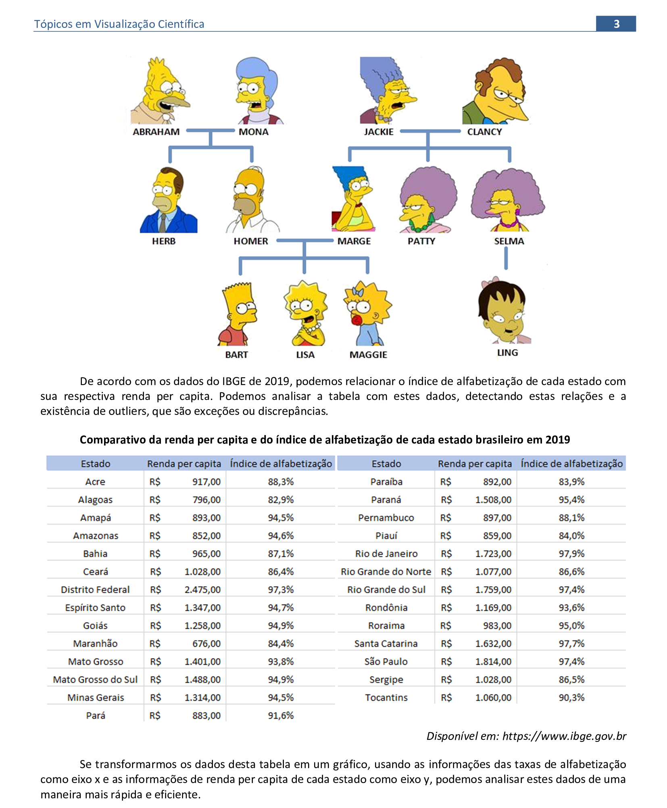
   
<a href="#modulo1" class="topo">voltar ao topo</a>

   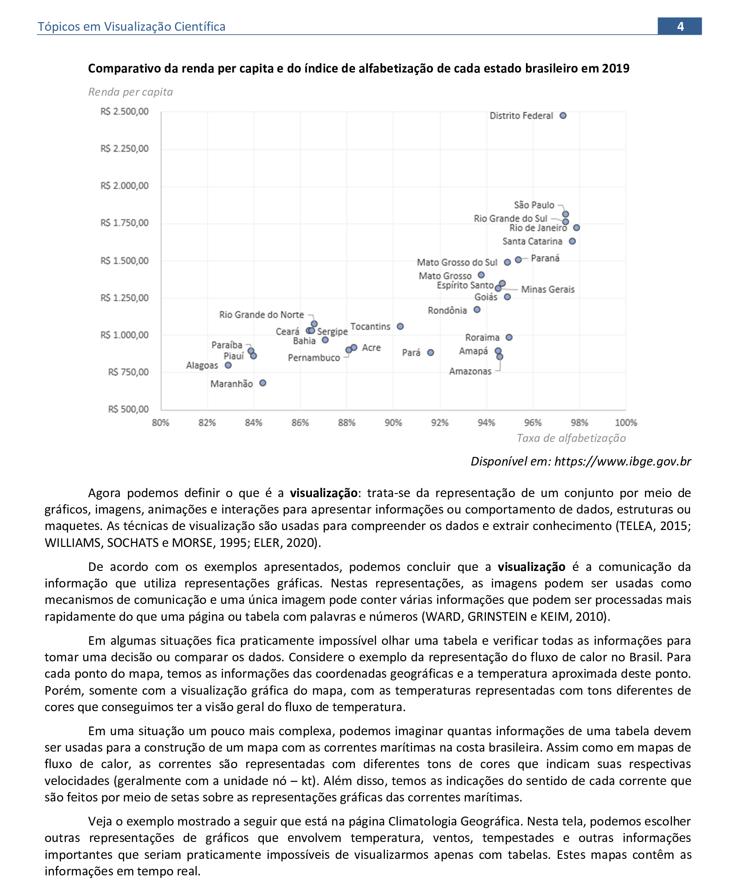
   
<a href="#modulo1" class="topo">voltar ao topo</a>

   
   
<a href="#modulo1" class="topo">voltar ao topo</a>

   
   
<a href="#modulo1" class="topo">voltar ao topo</a>

   
   
<a href="#modulo1" class="topo">voltar ao topo</a>

   
   
<a href="#modulo1" class="topo">voltar ao topo</a>

   
   
<a href="#modulo1" class="topo">voltar ao topo</a>

   
   
<a href="#modulo1" class="topo">voltar ao topo</a>

   
   
<a href="#modulo1" class="topo">voltar ao topo</a>

   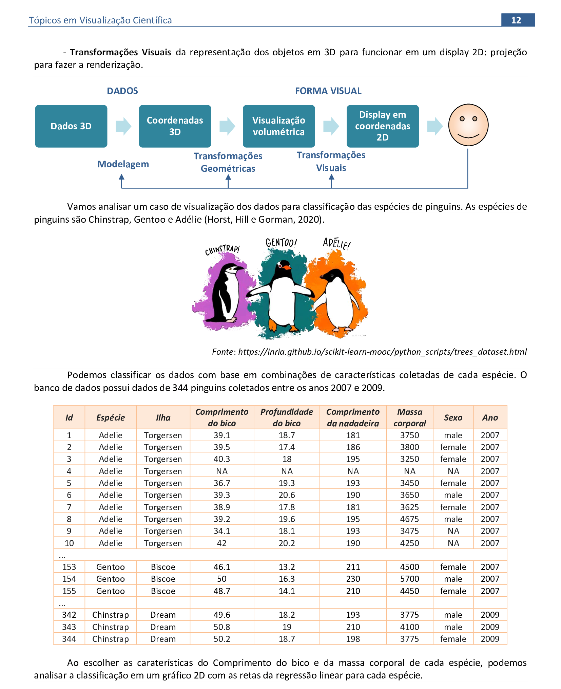
   
<a href="#modulo1" class="topo">voltar ao topo</a>

   
   
<a href="#modulo1" class="topo">voltar ao topo</a>

   
   
<a href="#modulo1" class="topo">voltar ao topo</a>

  
2. Conceitos básicos e estruturais de visualização

  
Material da página 14 até a página 24.

  
  
  

&#x1f4c3; Código

  <figcaption>Código em C++ com Matplotlib:
<pre><code>#include <a alt="vetores de coordenadas">&lt;vector&gt;</a> 
&#x23;include <a alt="biblioteca matplotlib">"matplotlibcpp.h"</a> 
Namespaceplt <a alt="gráfico que será construído">plt=matplotlibcpp;</a> 

intmain()&#123;
std::vector&lt;double&gt;<a alt="coordenadas x">x=&#123;0, 1, 2, 3, 4, 5&#125;;</a>
std::vector&lt;double&gt;<a alt="coordenadas y">y=&#123;1, 4, 9, 16, 32, 64&#125;;</a>
<a alt="gráfico de dispersão 2D, marcador circular e vermelho">plt::scatter(x,y,{&#125;"color","red"&#123;,&#123;"marker":"o"&#125;&#125;);</a>
<a alt="comando para visualizar o gráfico">plt::show();</a>

return0;
&#125;

</code></pre></figcaption>
  

  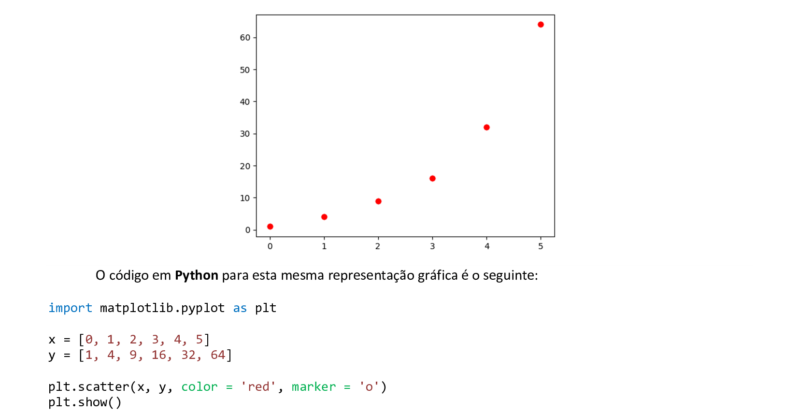
  

&#x1f4c3; Código

  <figcaption>Código em Python com Matplotlib:
<pre><code>import <a alt="gráfico plt da biblioteca matplotlib ">matplotlib.pyplot as plt</a> 

<a alt="coordenadas x">x =</a> [0, 1, 2, 3, 4, 5]
<a alt="coordenadas y">y =</a> [1, 4, 9, 16, 32, 64]

<a alt="gráfico de dispersão 2D">plt.scatter</a>(x, y, <a alt="marcador vermelho">color =</a> 'red', <a alt="marcador circular">marker =</a> 'o')</a>
<a alt="comando para visualizar o gráfico">plt.show()</a>

</code></pre></figcaption>
  

  
  
<a href="#modulo2" class="topo">voltar ao topo</a>

  
  

&#x1f4c3; Código

  <figcaption>Gráfico de dispersão 3D:
<pre><code>import <a alt="gráfico plt da biblioteca matplotlib ">matplotlib.pyplot as plt</a> 

<a alt="coordenadas x">x =</a> [0, 1, 2, 3, 4, 5]
<a alt="coordenadas y">y =</a> [1, 4, 9, 16, 32, 64]
<a alt="coordenadas z">z =</a> [2, 7, 11, 5, 3, 1]

<a alt="tipo de projeção 3D; gráfico atribuído na variável ax">ax =</a> plt.figure().add_subplot(projection = '3d')

<a alt="gráfico de dispersão 3D, marcador circular e vermelho">ax.scatter(x, y,</a> z, color = 'r', marker = 'o')

plt.show()

</code></pre></figcaption>
  

  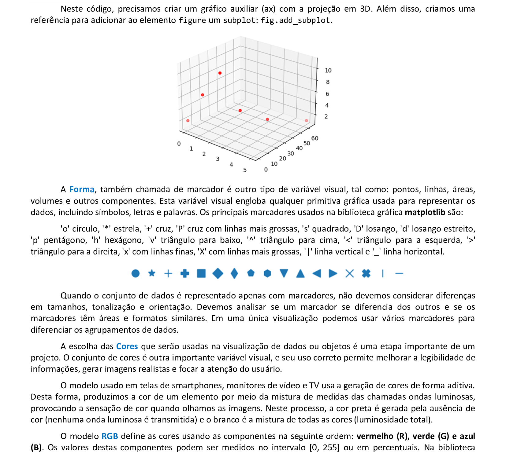
  
<a href="#modulo2" class="topo">voltar ao topo</a>

  
  
<a href="#modulo2" class="topo">voltar ao topo</a>

  
  
<a href="#modulo2" class="topo">voltar ao topo</a>

  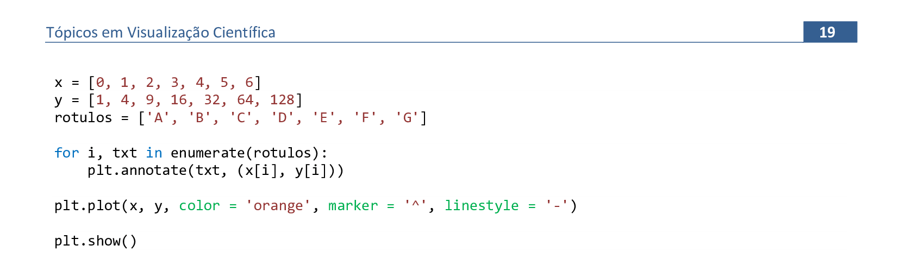
  

&#x1f4c3; Código

  <figcaption>Gráfico de dispersão 2D com rótulos:
<pre><code>import matplotlib.pyplot as plt 

x = [0, 1, 2, 3, 4, 5, 6]
y = [1, 4, 9, 16, 32, 64, 128]
<a alt="rótulos dos pontos">rotulos =</a> ['A', 'B', 'C', 'D', 'E', 'F', 'G']

<a alt="laço para rotular cada ponto">for i, txt in enumerate(rotulos):</a>
    plt.annotate(txt, (x[i], y[i]))
	
plt.plot(x, y, <a alt="marcador laranja">color =</a> 'orange', <a alt="marcador triângular">marker =</a> '^', <a alt="linha contínua">linestyle =</a> '-')</a>

plt.show()
</code></pre></figcaption>
  

  
  
<a href="#modulo2" class="topo">voltar ao topo</a>

  
  

&#x1f4c3; Código

  <figcaption>Gráfico de dispersão 3D com rótulos:
<pre><code>import matplotlib.pyplot as plt

ax = plt.figure().add_subplot(projection = '3d')

x = [0, 1, 2, 3, 4, 5]
y = [1, 4, 9, 16, 32, 64]
z = [2, 7, 11, 5, 3, 1]
<a alt="rótulos dos pontos">rotulos =</a> ['A', 'B', 'C', 'D', 'E', 'F']

<a alt="gráfico de dispersão 3D">ax.scatter(x, y,</a> z, color = 'r', marker = 'o')</a>

<a alt="laço para rotular cada ponto">for x, y, z, tag in zip(x, y, z, rotulos):</a>
    label = tag
    ax.text3D(x, y, z, label, <a alt="direção dos rótulos: eixo z">zdir = 'z'</a>)
	
plt.show()
</code></pre></figcaption>
  

  
  

&#x1f4c3; Código

  <figcaption>Gráfico de curvas 2D com legendas:
<pre><code>import matplotlib.pyplot as plt
import <a alt="biblioteca de operações matemáticas">numpy as np</a>

<a alt="intervalo [0, 5] com espaçamento 0.1">x = np.arange(0, 5, 0.1)</a>

<a alt="função linear">plt.plot</a>(x, x, <a alt="linha tracejada azul">'b--',</a> label = 'y = x')</a>
<a alt="função linear">plt.plot</a>(x, 2*x+1, <a alt="linha contínua verde">'g-',</a> label = 'y = 2x + 1')</a>
<a alt="função quadrática">plt.plot</a>(x, x**2+2*x+3, <a alt="linha traço-ponto vermelha">'r-.',</a> label = 'y = x^2 + 2x + 3')</a>

<a alt="rótulo do eixo x">plt.xlabel('x')</a>
<a alt="rótulo do eixo y">plt.ylabel('y')</a>
<a alt="título do gráfico">plt.title('Gráfico de curvas 2D')</a>

plt.show()
plt.legend()
</code></pre></figcaption>
  

  
<a href="#modulo2" class="topo">voltar ao topo</a>

  
  

&#x1f4c3; Código

  <figcaption>Gráficos de curvas 2D:
<pre><code>import matplotlib.pyplot as plt
import numpy as np

<a alt="definição da função f">def f(x):</a>
    return np.exp(-x) * np.cos(2*np.pi*x)

<a alt="intervalo do primeiro gráfico">x1 =</a> np.arange(5, 12, 0.05)
<a alt="intervalo do segundo gráfico">x2 =</a> np.arange(-2, 5, 0.05)

plt.figure()
<a alt="1 linha e 2 colunas de gráficos: gráfico 121">plt.subplot(121)</a>
plt.plot(x1, f(x1), <a alt="linha tracejada azul no intervalo x1">'b--',</a> x2, f(x2), <a alt="traço e ponto verde no intervalo x2">'g-.')</a>

<a alt="1 linha e 2 colunas de gráficos: gráfico 122">plt.subplot(122)</a>
plt.plot(x2, np.cos(2*np.pi*x2), <a alt="linha pontilhada laranja no intervalo x2">color = 'orange', linestyle = ':')</a>
plt.show()
</code></pre></figcaption>
  

  
  
<a href="#modulo2" class="topo">voltar ao topo</a>

  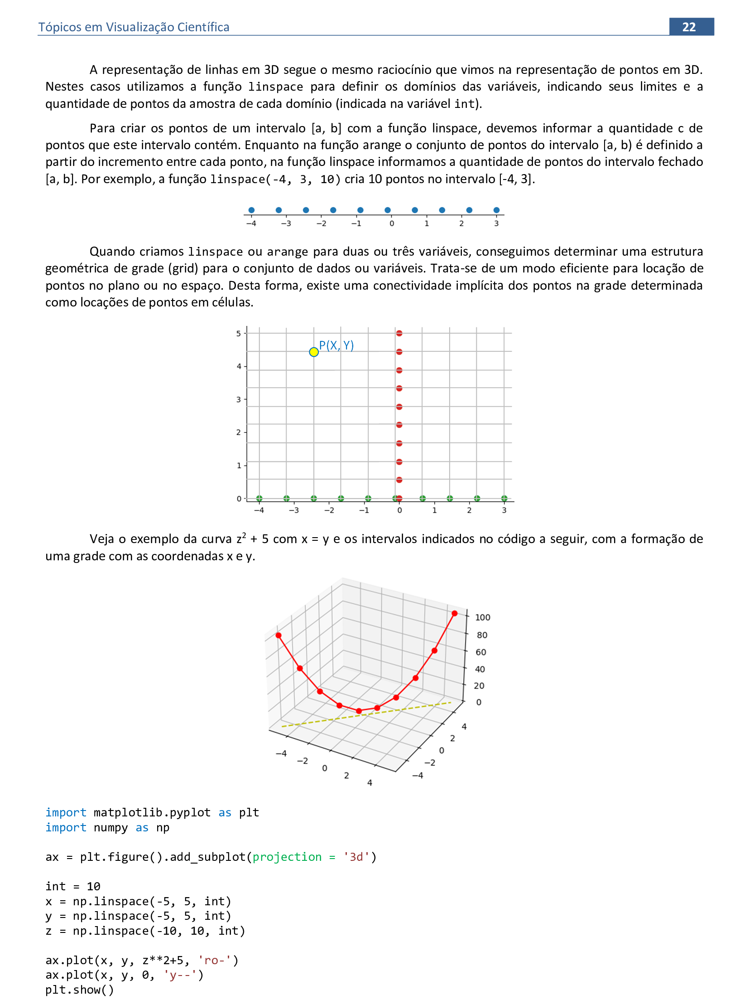
  

&#x1f4c3; Código

  <figcaption>Gráficos de curvas 3D:
<pre><code>import matplotlib.pyplot as plt
import numpy as np

ax = plt.figure().add_subplot(projection = '3d')

int = 10
<a alt="intervalo de x com 10 pontos">x =</a> np.linspace(-5, 5, int)
<a alt="intervalo de y com 10 pontos">y =</a> np.linspace(-5, 5, int)
<a alt="intervalo de z com 10 pontos">z =</a> np.linspace(-10, 10, int)

<a alt="gráfico da função quadrática com marcadores circulares vermelhos">ax.plot(x, y, z**2+5, 'ro-')</a>
<a alt="gráfico da função linear com linha contínua laranja">ax.plot(x, y, 0, 'y--')</a>

plt.show()
</code></pre></figcaption>
  

  
<a href="#modulo2" class="topo">voltar ao topo</a>

  
  

&#x1f4c3; Código

  <figcaption>Gráfico da hélice cilíndrica:
<pre><code>import matplotlib.pyplot as plt
import numpy as np

ax = plt.figure().add_subplot(projection = '3d')

d = 5
<a alt="grid para a variável z">z =</a> np.linspace(-10, 10, 100)</a>
<a alt="equação com parâmetro d para x">x =</a> d * np.sin(z)
<a alt="equação com parâmetro d para y">y =</a> d * np.cos(z)

<a alt="gráfico da hélice cilíndrica com linha contínua verde">ax.plot(x, y, z, 'g-', label = 'hélice cilíndrica')</a>
ax.legend()

plt.show()
</code></pre></figcaption>
  

  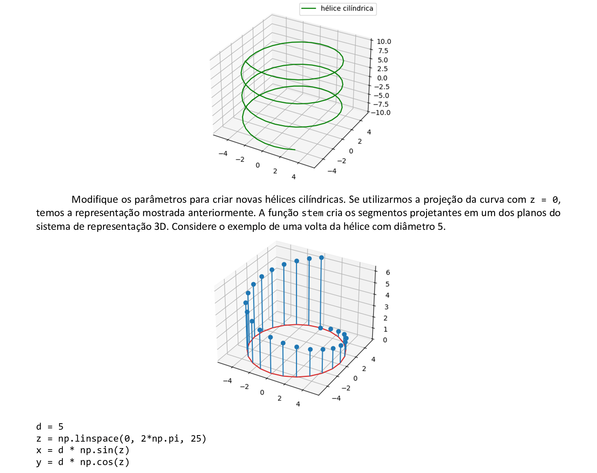
  
<a href="#modulo2" class="topo">voltar ao topo</a>

  
  

&#x1f4c3; Código

  <figcaption>Gráfico da hélice cilíndrica com segmentos projetantes:
<pre><code>import matplotlib.pyplot as plt
import numpy as np

ax = plt.figure().add_subplot(projection = '3d')

d = 5
z = np.linspace(0, 2*np.pi, 25)
x = d * np.sin(z)
y = d * np.cos(z)

<a alt="gráfico da hélice cilíndrica com segmentos projetantes">ax.stem(x, y, z)</a>

plt.show()
</code></pre></figcaption>
  

  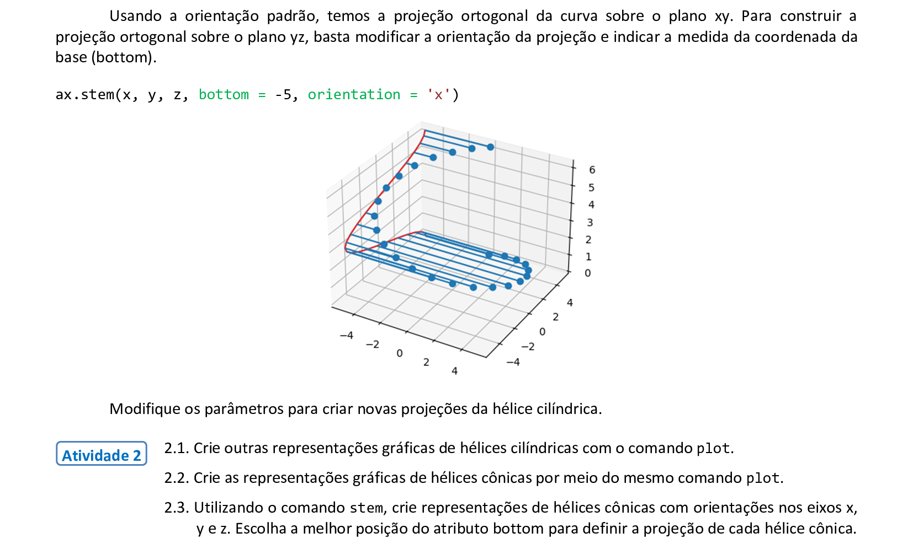
  
<a href="#modulo2" class="topo">voltar ao topo</a>

  
3. Fundamentos dos dados

  
Material da página 24 até a página 54.

  
  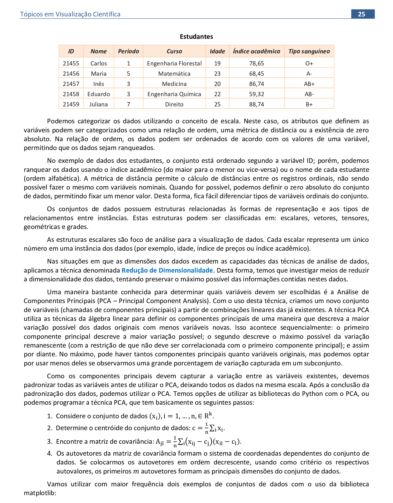
  
<a href="#modulo3" class="topo">voltar ao topo</a>

  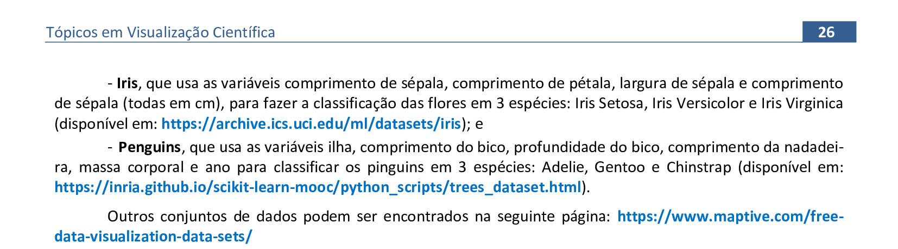
  

&#x1f517; Links

  <figcaption>Conjunto Iris: <a href="https://archive.ics.uci.edu/ml/datasets/iris" target="_blank">https://archive.ics.uci.edu/ml/datasets/iris</a>
   Conjunto dos Pinguins: <a href="https://inria.github.io/scikit-learn-mooc/python_scripts/trees_dataset.html" target="_blank">https://inria.github.io/scikit-learn-mooc/python_scripts/trees_dataset.html</a>
   Outros conjuntos de dados: <a href="https://www.maptive.com/free-data-visualization-data-sets/" target="_blank">https://www.maptive.com/free-data-visualization-data-sets/</a>
  </figcaption>

  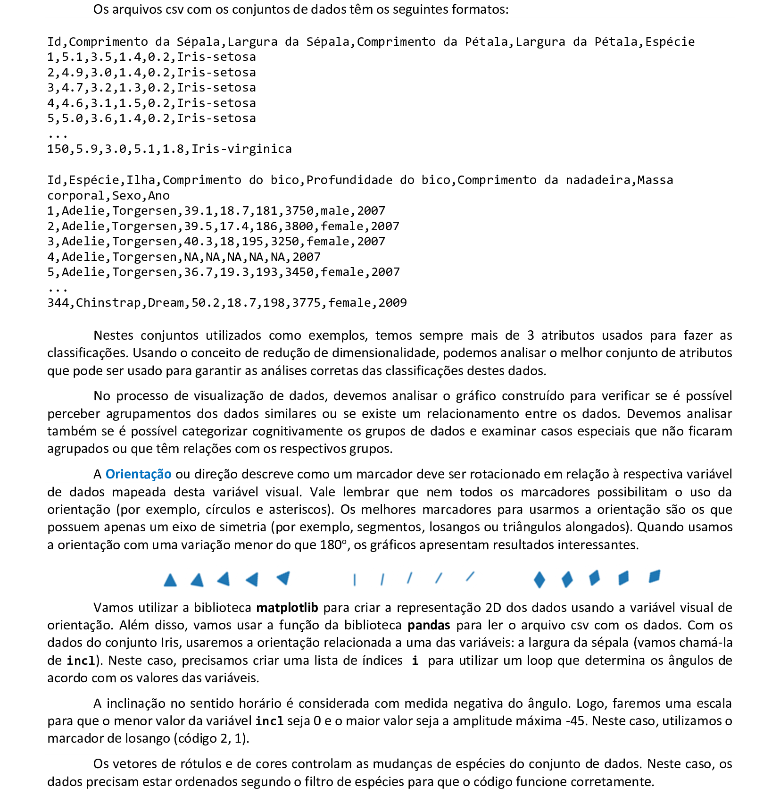
  
<a href="#modulo3" class="topo">voltar ao topo</a>

  
  

&#x1f4c3; Código

  <figcaption>Conjunto de dados Iris com matplotlib (cor e movimento):
<pre><code><a alt="biblioteca para leitura dos dados em formato CSV">import pandas as pd</a>
import numpy as np
from matplotlib import pyplot as plt

iris = <a alt="leitura do arquivo CSV">pd.read_csv('C:/dados/iris.csv')</a>

<a alt="variável usada para contar o número de registros">incl = np.array(iris.loc[:,'Largura da Sépala'])</a>
<a alt="variável x">x =</a> np.array(iris.loc[:,'Comprimento da Sépala'])
<a alt="variável y">y =</a> np.array(iris.loc[:,'Comprimento da Pétala'])
<a alt="atributo usado para separação dos dados">z =</a> np.array(iris.loc[:,'Espécie'])

<a alt="criação da grade com a quantidade de registros">i =</a> np.arange(0, len(incl), 1)
<a alt="ajuste dos dados usando os limites max e min">j =</a> (incl - min(incl))/(max(incl) - min(incl))
<a alt="amplitude máxima de 45&deg;">w =</a> -45*j

<a alt="rótulos dos dados com as espécies">label =</a> ['Iris-setosa', 'Iris-versicolor', 'Iris-virginica']
<a alt="vetor com a cor de cada espécie">cor =</a> ['orange', 'green', 'red']
j = 0

<a alt="laço usado para separar as espécies">for k in i:</a>
    <a alt="marcador de cada registro">marker =</a> (2, 1, w[k])
    if <a alt="com os dados ordenados, o marcador muda quando z[k] &ne; z[k-1]">z[k] == z[k-1]:</a>
        plt.plot(x[k], y[k], <a alt="marcadores">marker =</a> marker, <a alt="tamanho dos marcadores">markersize =</a> 10, <a alt="cores dos marcadores">color =</a> cor[j - 1], <a alt="opacidade">alpha =</a> 0.6)
    else:
        j +=1
        plt.plot(x[k], y[k], marker = marker, markersize = 10, color = cor[j - 1], alpha = 0.6, 
        <a alt="alteração do rótulo">label =</a> label[j - 1] )

<a alt="legendas dos dados e eixos">plt.legend(scatterpoints = 1)</a>
plt.xlabel('Comprimento da Sépala')
plt.ylabel('Comprimento da Pétala')
plt.grid()
plt.show()
</code></pre></figcaption>
  

  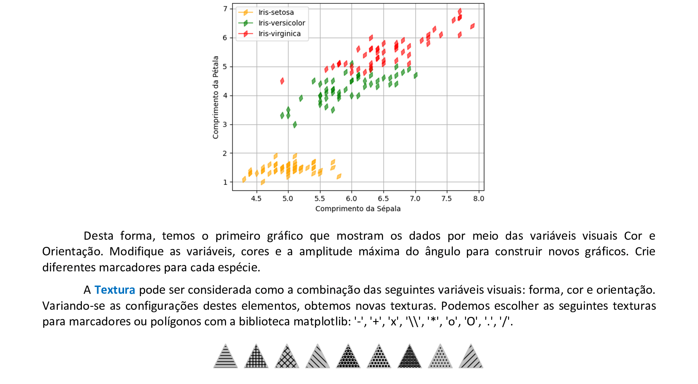
  
<a href="#modulo3" class="topo">voltar ao topo</a>

  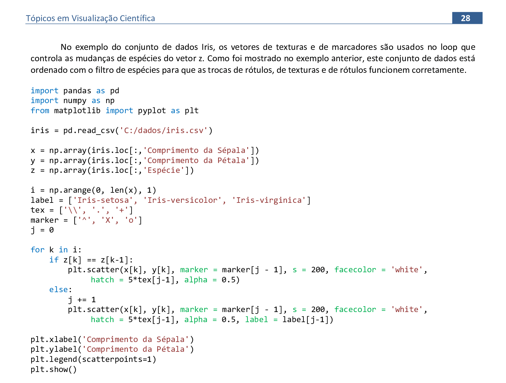
  

&#x1f4c3; Código

  <figcaption>Conjunto de dados Iris com matplotlib (textura):
<pre><code>import pandas as pd
import numpy as np
from matplotlib import pyplot as plt

iris = pd.read_csv('C:/dados/iris.csv')

x = np.array(iris.loc[:,'Comprimento da Sépala'])
y = np.array(iris.loc[:,'Comprimento da Pétala'])
z = np.array(iris.loc[:,'Espécie'])

i = np.arange(0, len(x), 1)

label = ['Iris-setosa', 'Iris-versicolor', 'Iris-virginica']
<a alt="textura de cada espécie">tex =</a> ['\\', '.', '+']
<a alt="marcadores de cada espécie">marker =</a> ['^', 'X', 'o']
j = 0

<a alt="laço usado para separar as espécies">for k in i:</a>
    if <a alt="com os dados ordenados, o marcador muda quando z[k] &ne; z[k-1]">z[k] == z[k-1]:</a>
        plt.scatter(x[k], y[k], <a alt="marcadores">marker =</a> marker[j - 1], <a alt="tamanho dos marcadores">s =</a> 200, <a alt="cor dos marcadores">facecolor =</a> 'white', 
        <a alt="textura">hatch =</a> 5*tex[j-1], alpha = 0.5)
    else:
        j += 1
        plt.scatter(x[k], y[k], marker = marker[j - 1], s = 200, facecolor = 'white', 
        hatch = 5*tex[j-1], alpha = 0.5, label = label[j-1])

plt.xlabel('Comprimento da Sépala')
plt.ylabel('Comprimento da Pétala')
plt.legend(scatterpoints = 1)
plt.show()
</code></pre></figcaption>
  

  
  
<a href="#modulo3" class="topo">voltar ao topo</a>

  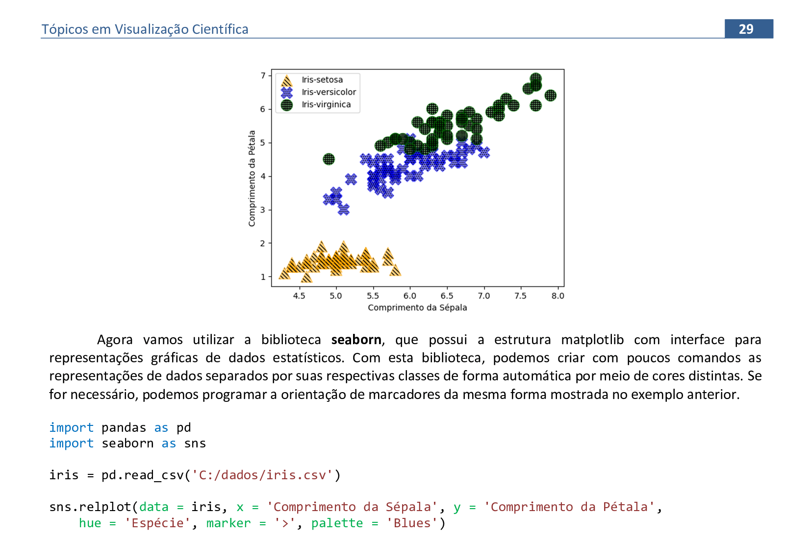
  

&#x1f4c3; Código

  <figcaption>Conjunto de dados Iris com Seaborn (cores):
<pre><code>import pandas as pd
<a alt="biblioteca Seaborn">import seaborn as sns</a>

iris = pd.read_csv('C:/dados/iris.csv')

sns.relplot(data = iris, x = 'Comprimento da Sépala', y = 'Comprimento da Pétala',
    <a alt="separação de classes: atributo Espécie">hue =</a> 'Espécie', <a alt="marcadores triangulares">marker =</a> '>', <a alt="paleta de cores em tons de azul">palette =</a> 'Blues')</a>
	
</code></pre></figcaption>
  

  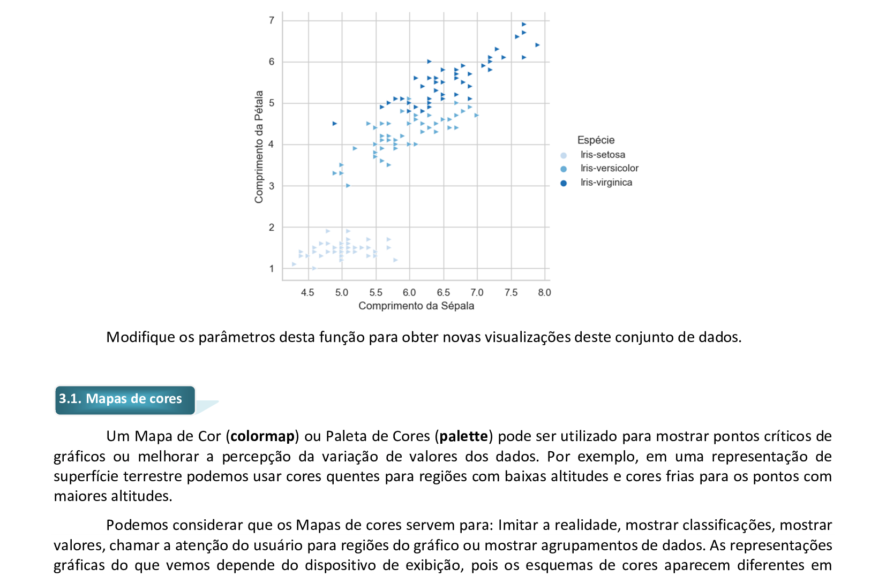
  
<a href="#modulo3" class="topo">voltar ao topo</a>

  
  
<a href="#modulo3" class="topo">voltar ao topo</a>

  
  
<a href="#modulo3" class="topo">voltar ao topo</a>

  
  
<a href="#modulo3" class="topo">voltar ao topo</a>

  
  

&#x1f4c3; Código

  <figcaption>Conjunto de dados Iris com Seaborn (cores e tamanhos):
<pre><code>import pandas as pd
import seaborn as sns

iris = pd.read_csv('C:/dados/iris.csv')

sns.relplot(data = iris, x = 'Comprimento da Sépala', y = 'Comprimento da Pétala',
    <a alt="separação de classes: atributo Espécie">hue =</a> 'Espécie', <a alt="marcadores quadrados">marker =</a> 's', <a alt="paleta de cores em tons de vermelho">palette =</a> 'Reds', <a alt="tamanhos dos marcadores">size =</a> 'Largura da Sépala')
	
</code></pre></figcaption>
  

  
  
<a href="#modulo3" class="topo">voltar ao topo</a>

  
  

&#x1f4c3; Código

  <figcaption>Conjunto de dados Iris com Seaborn (dispersão e frequência):
<pre><code>import pandas as pd
import seaborn as sns

iris = pd.read_csv('C:/dados/iris.csv')

<a alt="mostra a grade">sns.set_style("whitegrid")</a>
<a alt="função de dispersão e frequência">sns.jointplot</a>(data = iris, x = 'Comprimento da Sépala', y = 'Comprimento da Pétala',
    hue = 'Espécie', <a alt="marcadores circulares">marker =</a> 'o', <a alt="paleta de cores rainbow">palette =</a> 'rainbow')
	
</code></pre></figcaption>
  

  
  
<a href="#modulo3" class="topo">voltar ao topo</a>

  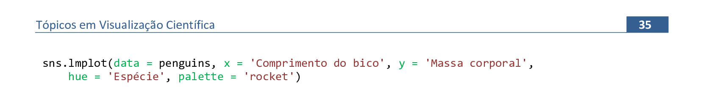
  

&#x1f4c3; Código

  <figcaption>Conjunto de dados dos pinguins com Seaborn (regressão linear):
<pre><code>import pandas as pd
import seaborn as sns

pinguins = pd.read_csv('C:/dados/penguin2.csv')

sns.set_style("whitegrid")
<a alt="função de dispersão e frequência">sns.lmplot</a>(data = pinguins, x = 'Comprimento do bico', y = 'Massa corporal',
    hue = 'Espécie', <a alt="paleta de cores rocket">palette =</a> 'rocket')

</code></pre></figcaption>
  

  
  
<a href="#modulo3" class="topo">voltar ao topo</a>

  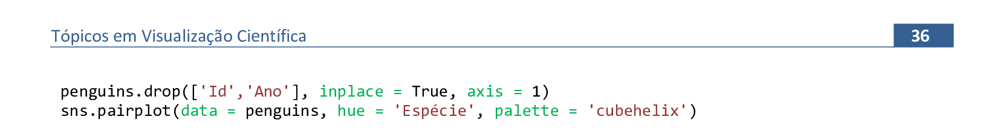
  

&#x1f4c3; Código

  <figcaption>Conjunto de dados dos pinguins com Seaborn (combinações de gráficos):
<pre><code>import pandas as pd
import seaborn as sns

pinguins = pd.read_csv('C:/dados/penguin2.csv')

sns.set_style("whitegrid")
<a alt="dados que devem ser desconsiderados">pinguins.drop(['Id','Ano'],</a> inplace = True, axis = 1)
<a alt="combinação de gráficos">sns.pairplot</a>(data = pinguins, hue = 'Espécie', <a alt="paleta de cores cubehelix">palette =</a> 'cubehelix')

</code></pre></figcaption>
  

  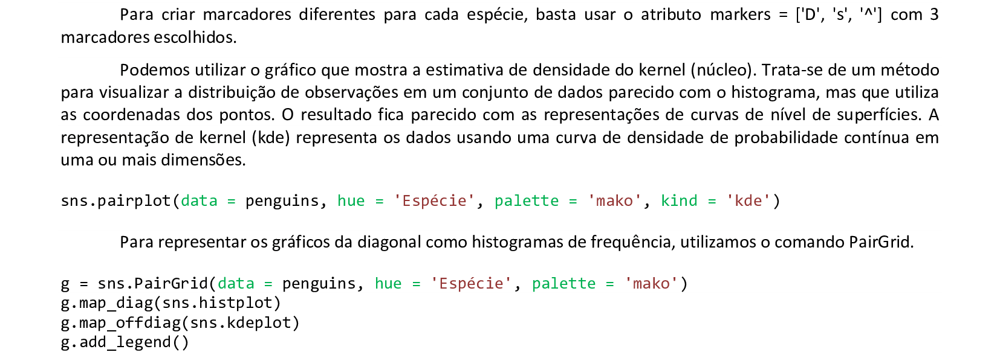
  

&#x1f4c3; Código

  <figcaption>Conjunto de dados dos pinguins com Seaborn (combinações de gráficos):
<pre><code>import pandas as pd
import seaborn as sns

pinguins = pd.read_csv('C:/dados/penguin2.csv')

sns.set_style("whitegrid")
pinguins.drop(['Id','Ano'], inplace = True, axis = 1)
<a alt="combinação de gráficos">g = sns.PairGrid</a>(data = pinguins, hue = 'Espécie', <a alt="paleta de cores mako">palette =</a> 'mako')
<a alt="histogramas na diagonal">g.map_diag(sns.histplot)</a>
<a alt="densidades de kernel fora da diagonal">g.map_offdiag(sns.kdeplot)</a>
g.add_legend()
</code></pre></figcaption>
  

  
  
<a href="#modulo3" class="topo">voltar ao topo</a>

  
  

&#x1f4c3; Código

  <figcaption>Conjunto de dados dos pinguins com Seaborn (combinações de gráficos):
<pre><code>import pandas as pd
import seaborn as sns

pinguins = pd.read_csv('C:/dados/penguin2.csv')

sns.set_style("whitegrid")
pinguins.drop(['Id','Ano'], inplace = True, axis = 1)
<a alt="combinação de gráficos">g = sns.PairGrid</a>(data = pinguins, hue = 'Espécie', <a alt="paleta de cores mako">palette =</a> 'mako')
<a alt="histogramas na diagonal">g.map_diag(sns.histplot)</a>
<a alt="dispersão na diagonal superior">g.map_upper(sns.scatterplot, size = pinguins['Sexo'])</a>
<a alt="densidades de kernel na diagonal inferior">g.map_lower(sns.kdeplot)</a>
g.add_legend(title = '', adjust_subtitles = True)
</code></pre></figcaption>
  

  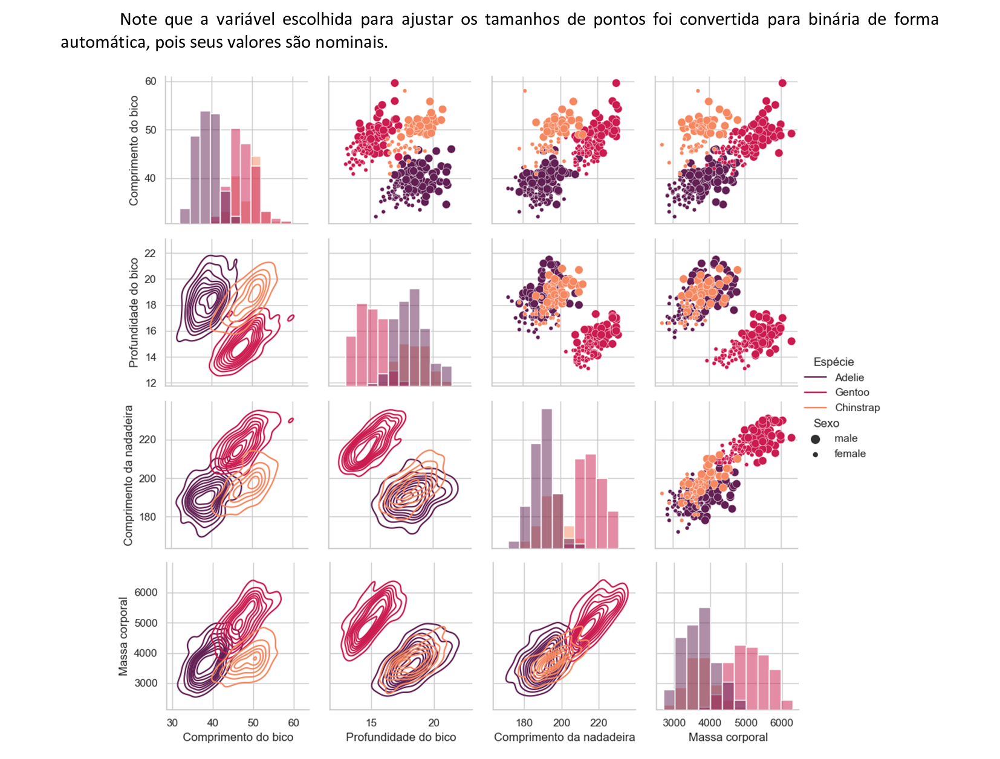
  

&#x1f4c3; Código

  <figcaption>Conjunto de dados Iris com Plotly (dispersão 3D):
<pre><code>import pandas as pd
<a alt="biblioteca plotly">import plotly.io as pio</a>
import plotly.express as px

iris = pd.read_csv('C:/dados/iris.csv')

pio.renderers
<a alt="a renderização é feita em um navegador de internet">pio.renderers.default = 'browser'</a>

fig = <a alt="gráfico de dispersão 3D">px.scatter_3d</a>(iris, x = 'Comprimento da Sépala', y = 'Comprimento da Pétala', 
    z = 'Largura da Sépala', <a alt="a cor é usada para separar as espécies">color =</a> 'Espécie')

fig.show()
</code></pre></figcaption>
  

  
<a href="#modulo3" class="topo">voltar ao topo</a>

  
  
<a href="#modulo3" class="topo">voltar ao topo</a>

  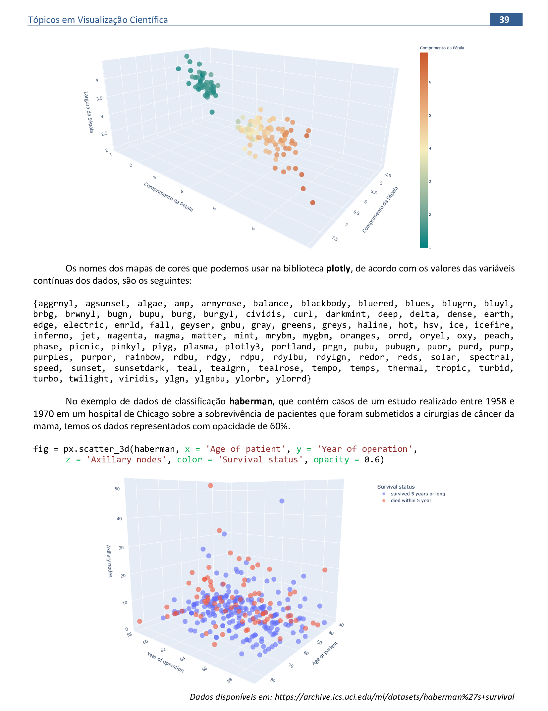
  
<a href="#modulo3" class="topo">voltar ao topo</a>

  
  

&#x1f4c3; Código

  <figcaption>Duas hélices (movimento):
<pre><code>import matplotlib.pyplot as plt
import numpy as np

ax = plt.figure().add_subplot(projection = '3d')

d = 1
e = 10
op = 0.9

z = np.arange(0, 200, 1)
x = d * np.sin(z/e)
y = d * np.cos(z/e)

<a alt="laço para mudar opacidade dos pontos">for k in z:</a>
    op *= 0.99
    ax.scatter(x[k], z[k], y[k], zdir = 'z', color = 'steelblue', alpha = op)
    ax.scatter(y[k] - d, d - z[k], x[k], zdir = 'z', color = 'lightcoral', alpha = op)

plt.show()
</code></pre></figcaption>
  

  
<a href="#modulo3" class="topo">voltar ao topo</a>

  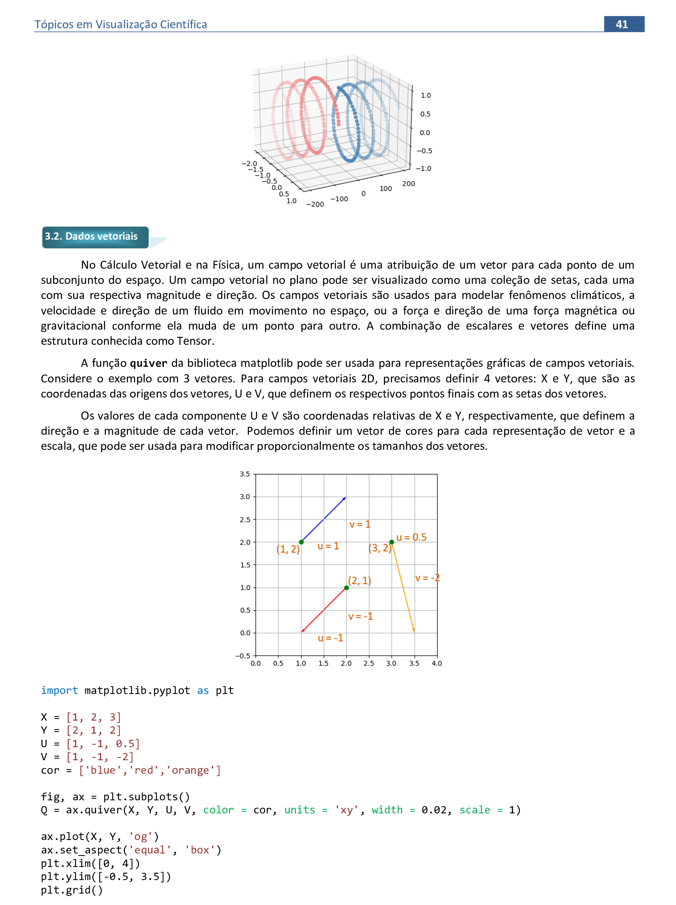
  
<a href="#modulo3" class="topo">voltar ao topo</a>

  
  

&#x1f4c3; Código

  <figcaption>Dados vetoriais 2D:
<pre><code>import matplotlib.pyplot as plt

X = [1, 2, 3]
Y = [2, 1, 2]
<a alt="deslocamento u relativo à coordenada x">U =</a> [1, -1, 0.5]
<a alt="deslocamento v relativo à coordenada y">V =</a> [1, -1, -2]
cor = ['blue','red','orange']

fig, ax = plt.subplots()
Q = <a alt="gráfico vetorial: quiver">ax.quiver</a>(X, Y, U, V, color = cor, units = 'xy', <a alt="espessura da linha e da seta">width =</a> 0.02, <a alt="escala do tamanho da seta">scale =</a> 1)

<a alt="pontos iniciais das setas">ax.plot(X, Y, 'og')</a>
ax.set_aspect('equal', 'box')

<a alt="limites dos eixos">plt.xlim([0, 4])</a>
plt.ylim([-0.5, 3.5])
plt.grid()
plt.show()
</code></pre></figcaption>
  

  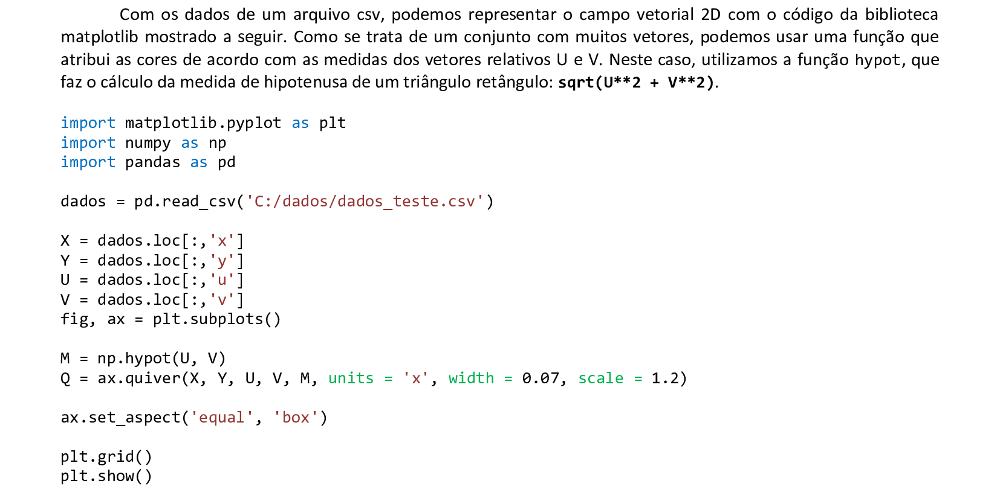
  

&#x1f4c3; Código

  <figcaption>Dados vetoriais 2D:
<pre><code>import matplotlib.pyplot as plt
import numpy as np
import pandas as pd

dados = pd.read_csv('C:/dados/dados_teste.csv')

X = dados.loc[:,'x']
Y = dados.loc[:,'y']
U = dados.loc[:,'u']
V = dados.loc[:,'v']
fig, ax = plt.subplots()

<a alt="vetor usado para criar cores usando os valores U e V">M = np.hypot(U, V)</a>
Q = ax.quiver(X, Y, U, V, M, units = 'x', width = 0.07, scale = 1.2)

ax.set_aspect('equal', 'box')

plt.grid()
plt.show()
</code></pre></figcaption>
  
&#x1f4ca; <a href="modulo3/dados_teste.csv" target="_blank">Arquivo CSV</a>

  

  
  
<a href="#modulo3" class="topo">voltar ao topo</a>

  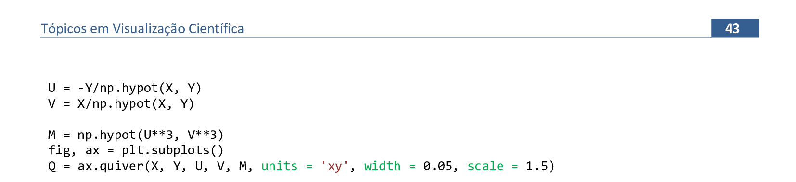
  

&#x1f4c3; Código

  <figcaption>Dados vetoriais 2D:
<pre><code>import matplotlib.pyplot as plt
import numpy as np

<a alt="extremidades na grade">X, Y =</a> np.meshgrid(np.arange(-5,5,0.5),np.arange(-5,5,0.5))

<a alt="relação do deslocamento de x com x e y">U =</a> -Y/np.hypot(X, Y)
<a alt="relação do deslocamento de y com x e y">V =</a> X/np.hypot(X, Y)

M = np.hypot(U**3, V**3)
fig, ax = plt.subplots()
Q = ax.quiver(X, Y, U, V, M, units = 'xy', width = 0.05, scale = 1.5)

ax.set_aspect('equal', 'box')

plt.show()
</code></pre></figcaption>
  

  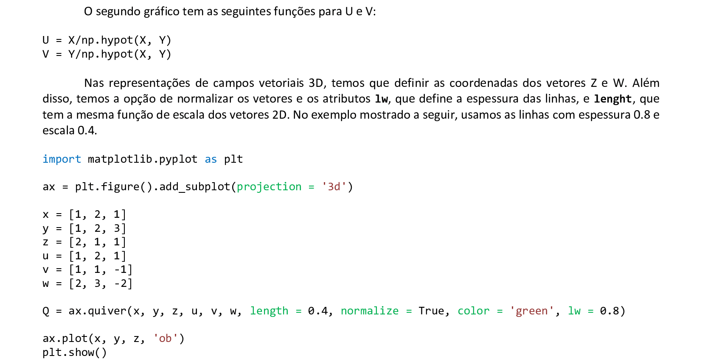
  

&#x1f4c3; Código

  <figcaption>Dados vetoriais 3D:
<pre><code>import matplotlib.pyplot as plt

ax = plt.figure().add_subplot(projection = '3d')

x = [1, 2, 1]
y = [1, 2, 3]
<a alt="variável z">z =</a> [2, 1, 1]
u = [1, 2, 1]
v = [1, 1, -1]
<a alt="deslocamento da variável z">w =</a> [2, 3, -2]

Q = ax.quiver(x, y, z, u, v, w, length = 0.4, <a alt="vetores normalizados">normalize =</a> True, color = 'green', <a alt="espessura">lw =</a> 0.8)

ax.plot(x, y, z, 'ob')
plt.show()
</code></pre></figcaption>
  

  
  
<a href="#modulo3" class="topo">voltar ao topo</a>

  
  

&#x1f4c3; Código

  <figcaption>Dados vetoriais 3D:
<pre><code>import matplotlib.pyplot as plt
import numpy as np

ax = plt.figure().add_subplot(projection = '3d')

<a alt="extremidades na grade">x, y, z =</a> np.meshgrid(np.arange(-2, 2, 0.5), np.arange(-2, 2, 0.5), np.arange(-2, 2, 0.5))
<a alt="relação do deslocamento de x com x e z">u =</a> x - z
<a alt="relação do deslocamento de y com y e z">v =</a> y + z
<a alt="relação do deslocamento de z">w =</a> z + 1

<a alt="relação de cores com a função arcsinh de v/u">cor =</a> np.arcsinh(v, u)
cor = (cor.flatten() - cor.min()) / cor.ptp()
<a alt="conversão de valores para o mapa de cores hsv">cor =</a> plt.cm.hsv(cor)

a = ax.quiver(x, y, z, u, v, w, length = 0.4, normalize = True, colors = cor, lw = 0.8)

plt.show()
</code></pre></figcaption>
  

  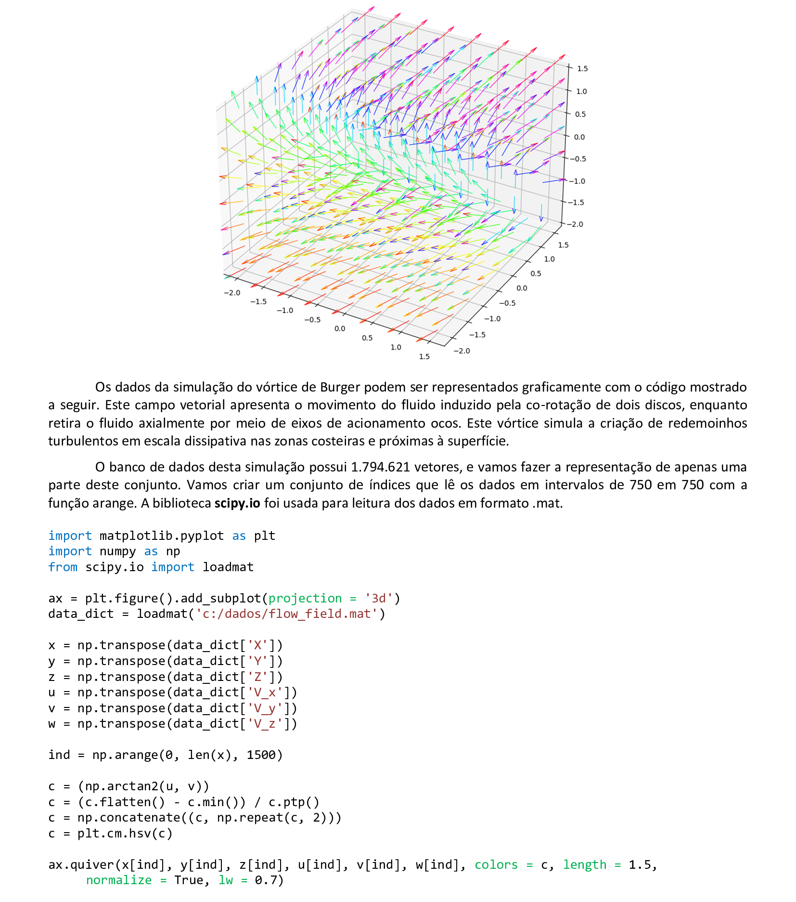
  
<a href="#modulo3" class="topo">voltar ao topo</a>

  
  

&#x1f4c3; Código

  <figcaption>Dados vetoriais 3D:
<pre><code>import matplotlib.pyplot as plt
import numpy as np
<a alt="biblioteca para leitura do arquivo mat">from scipy.io import loadmat</a>

ax = plt.figure().add_subplot(projection = '3d')
<a alt="leitura do arquivo de dados">data_dict =</a> loadmat('c:/dados/flow_field.mat')

x = np.transpose(data_dict['X'])
y = np.transpose(data_dict['Y'])
z = np.transpose(data_dict['Z'])
u = np.transpose(data_dict['V_x'])
v = np.transpose(data_dict['V_y'])
w = np.transpose(data_dict['V_z'])

ind = np.arange(0, len(x), 1500)

<a alt="relação de cores com a função arctan2 de u/v">c =</a> (np.arctan2(u, v))
c = (c.flatten() - c.min()) / c.ptp()
c = np.concatenate((c, np.repeat(c, 2)))
<a alt="conversão de valores para o mapa de cores hsv">c =</a> plt.cm.hsv(c)

ax.quiver(x[ind], y[ind], z[ind], u[ind], v[ind], w[ind], colors = c, length = 1.5, 
    normalize = True, lw = 0.7)

plt.show()
</code></pre></figcaption>
  
&#x1f4ca; <a href="modulo3/flow_field.zip" target="_blank">Arquivo MAT</a>

  

  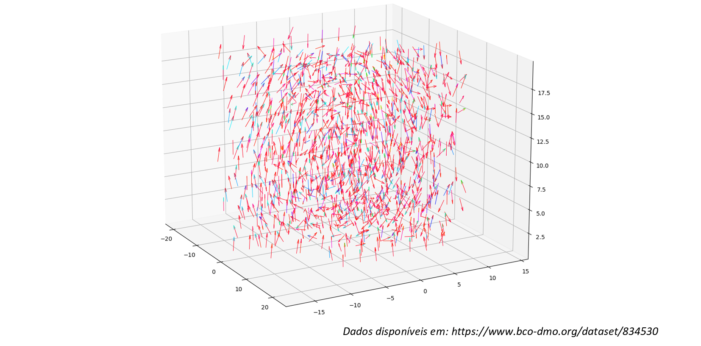
  
<a href="#modulo3" class="topo">voltar ao topo</a>

  
  

&#x1f4c3; Código

  <figcaption>Dados vetoriais 3D:
<pre><code>import numpy as np
import matplotlib.pyplot as plt
<a alt="biblioteca para leitura do arquivo nc">import netCDF4 as nc</a>

<a alt="leitura do arquivo de dados">data =</a> nc.Dataset('C:/dados/tornado3d.nc')
ax = plt.figure().add_subplot(projection = '3d')

u = np.array(data['u'])
v = np.array(data['v'])
w = np.array(data['w'])
xx = np.array(data['xdim'])
yy = np.array(data['ydim'])
zz = np.array(data['zdim'])

x, y, z = np.meshgrid(xx, yy, zz)

<a alt="relação de cores com a função arctan2 de v/u">c =</a> (np.arctan2(v, u))
c = (c.flatten() - c.min()) / c.ptp()
c = np.concatenate((c, np.repeat(c, 2)))
<a alt="conversão de valores para o mapa de cores hsv">c =</a> plt.cm.hsv(c)

a = ax.quiver(x, z, y, w, u, v, colors = c, length = 0.05, normalize = True, 
    lw = 2, alpha = 0.1)

plt.show()
</code></pre></figcaption>
  
&#x1f4ca; <a href="modulo3/tornado3d.zip" target="_blank">Arquivo NC</a>

  

  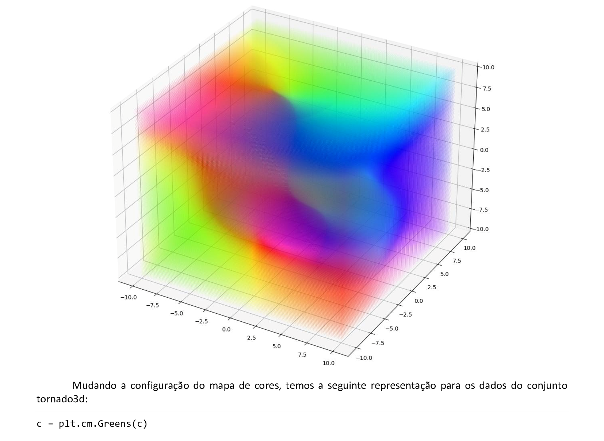
  
<a href="#modulo3" class="topo">voltar ao topo</a>

  
  
<a href="#modulo3" class="topo">voltar ao topo</a>

  
  

&#x1f4c3; Código

  <figcaption>Linhas de fluxo 2D:
<pre><code>import plotly.figure_factory as ff
import numpy as np
import plotly.io as pio

pio.renderers
pio.renderers.default = 'browser'

x = np.linspace(-1, 1, 10)
y = np.linspace(-1, 1, 10)
Y, X = np.meshgrid(x, y)
u = 1 - X**2 + Y
v = -1 + X - Y**2
  
fig = <a alt="função para criar as linhas de fluxo: streamlines">ff.create_streamline</a>(x, y, u, v, arrow_scale = 0.05)

fig.show()
</code></pre></figcaption>
  

  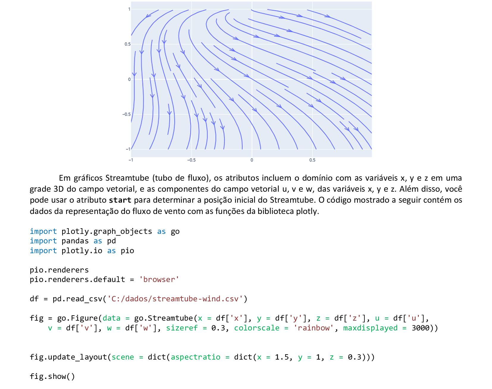
  

&#x1f4c3; Código

  <figcaption>Linhas de fluxo 3D:
<pre><code>import plotly.graph_objects as go
import pandas as pd
import plotly.io as pio

pio.renderers
pio.renderers.default = 'browser'

df = pd.read_csv('C:/dados/streamtube-wind.csv')

fig = go.Figure(data = <a alt="função para criar as linhas de fluxo 3D: streamtubes">go.Streamtube</a>(x = df['x'], y = df['y'], z = df['z'], u = df['u'],
    v = df['v'], w = df['w'], sizeref = 0.3, colorscale = 'rainbow', maxdisplayed = 3000))

fig.update_layout(scene = dict(aspectratio = dict(x = 1.5, y = 1, z = 0.3)))

fig.show()
</code></pre></figcaption>
  
&#x1f4ca; <a href="modulo3/streamtube-wind.zip" target="_blank">Arquivo CSV</a>

  

  
<a href="#modulo3" class="topo">voltar ao topo</a>

  
  
<a href="#modulo3" class="topo">voltar ao topo</a>

  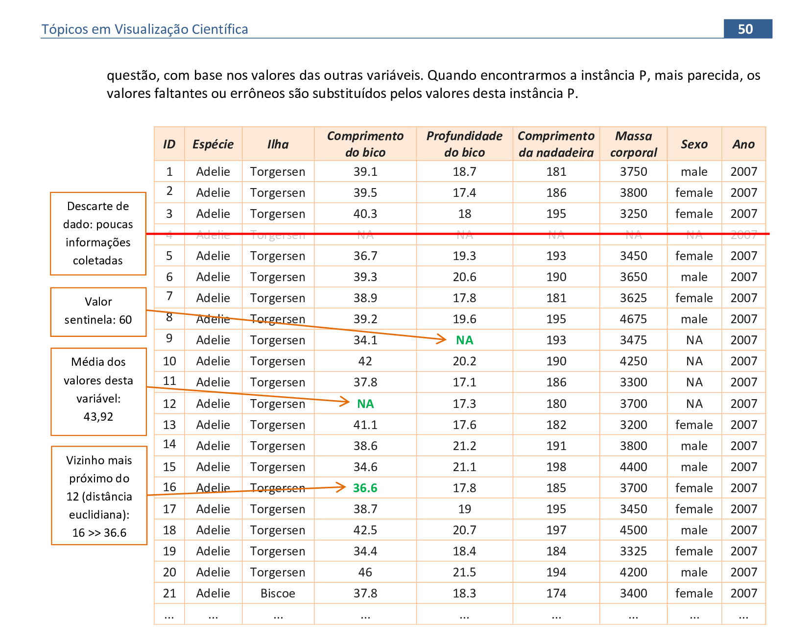
  
<a href="#modulo3" class="topo">voltar ao topo</a>

  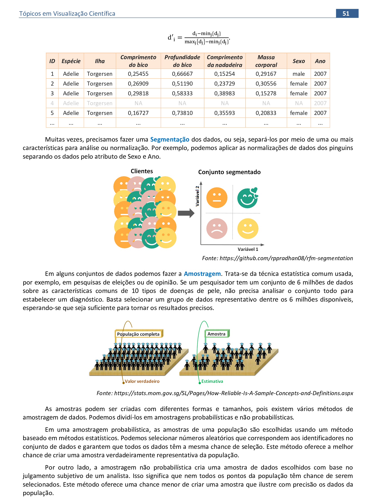
  
<a href="#modulo3" class="topo">voltar ao topo</a>

  
  
<a href="#modulo3" class="topo">voltar ao topo</a>

  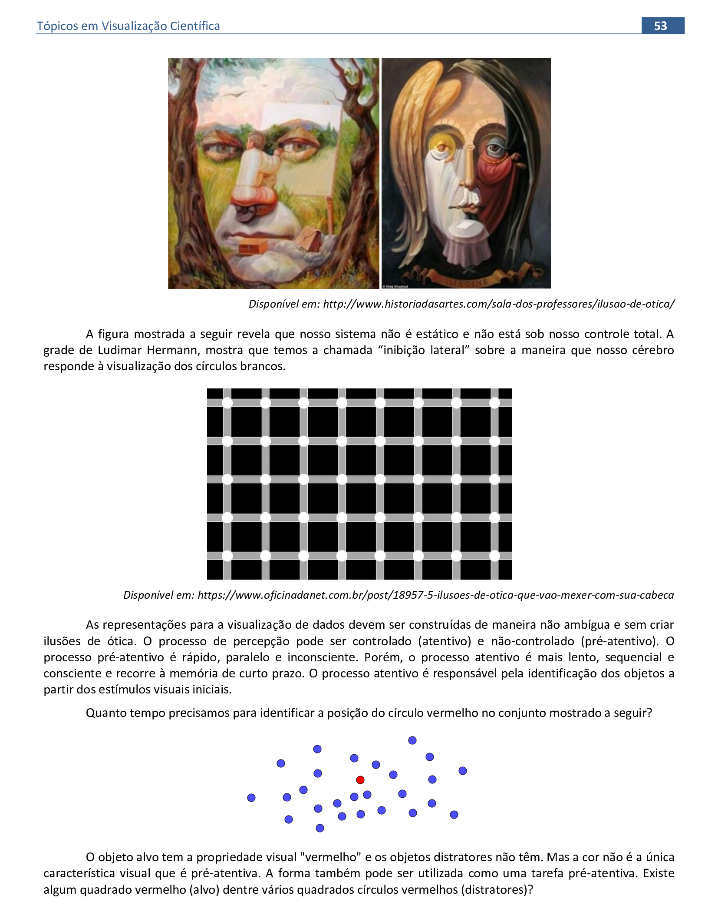
  
<a href="#modulo3" class="topo">voltar ao topo</a>

  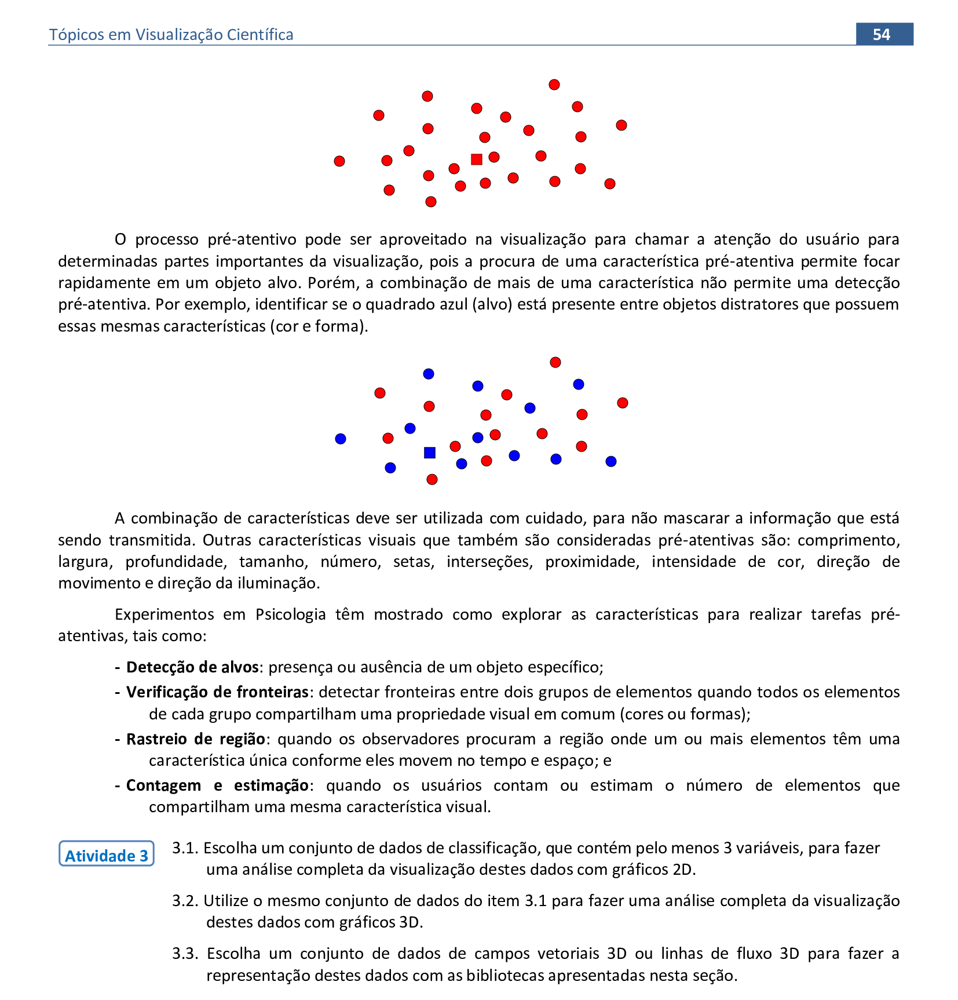
  
<a href="#modulo3" class="topo">voltar ao topo</a>

  
4. Taxonomia dos dados

  
Material da página 54 até a página 81.

  
  
  
<a href="#modulo4" class="topo">voltar ao topo</a>

  
  
<a href="#modulo4" class="topo">voltar ao topo</a>

  
  
<a href="#modulo4" class="topo">voltar ao topo</a>

  
  
<a href="#modulo4" class="topo">voltar ao topo</a>

  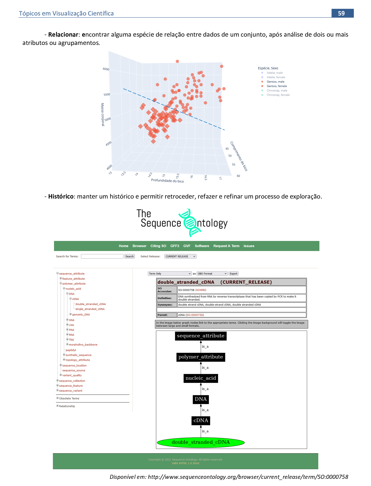
  
<a href="#modulo4" class="topo">voltar ao topo</a>

  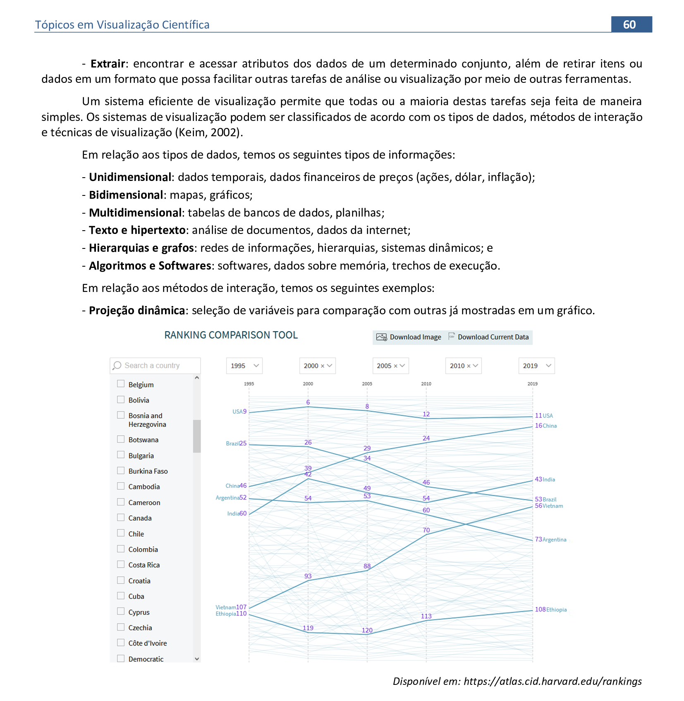
  
<a href="#modulo4" class="topo">voltar ao topo</a>

  
  
<a href="#modulo4" class="topo">voltar ao topo</a>

  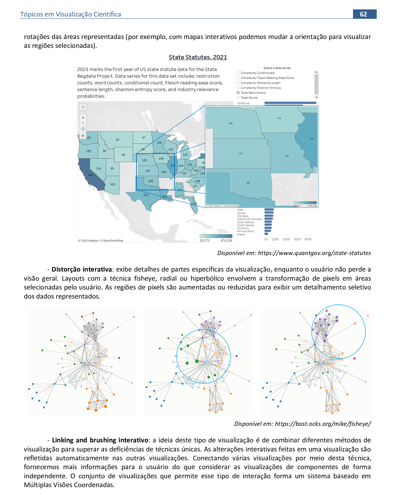
  
<a href="#modulo4" class="topo">voltar ao topo</a>

  
  
<a href="#modulo4" class="topo">voltar ao topo</a>

  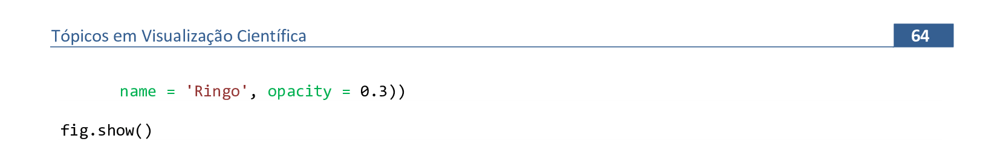
  

&#x1f4c3; Código

  <figcaption>Gráfico radar (polar):
<pre><code>import plotly.io as pio
pio.renderers
pio.renderers.default = 'browser'
import plotly.graph_objects as go

<a alt="rótulos das categorias de classificação">rotulos =</a> ['Composition','Vocal','Rhythm', 'Solos', 'Humour']

fig = go.Figure()

fig.add_trace(<a alt="função do gráfico radar (polar)">go.Scatterpolar</a>(r = [10, 8, 6, 5, 9], <a alt="valores de cada categoria do primeiro dado">theta =</a> rotulos, fill = 'toself', 
name = 'John', opacity = 0.3))
fig.add_trace(go.Scatterpolar(r = [10, 8, 6, 7, 6], theta = rotulos, fill = 'toself', 
name = 'Paul', opacity = 0.3))
fig.add_trace(go.Scatterpolar(r = [8, 7, 6, 10, 5], theta = rotulos, fill = 'toself', 
name = 'George', opacity = 0.3))
fig.add_trace(go.Scatterpolar(r = [2, 2, 10, 5, 5], theta = rotulos, fill = 'toself', 
name = 'Ringo', opacity = 0.3))

fig.show()
</code></pre></figcaption>
  

  
  
<a href="#modulo4" class="topo">voltar ao topo</a>

  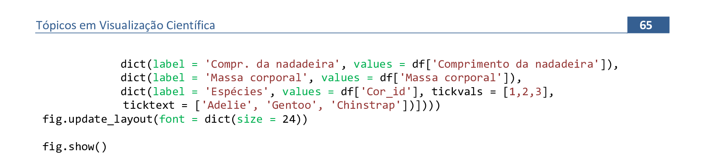
  

&#x1f4c3; Código

  <figcaption>Gráfico com coordenadas paralelas:
<pre><code>import pandas as pd
import plotly.io as pio
import plotly.graph_objects as go
pio.renderers
pio.renderers.default = 'browser'

df = pd.read_csv('C:/dados/penguin2.csv')

fig = go.Figure(data = <a alt="função do gráfico de coordenadas paralelas">go.Parcoords</a>(line = dict(color = <a alt="valores das cores para classificação">df['Cor_id']</a>,
    <a alt="escala de cores da classificação">colorscale =</a> [[0,'purple'],[0.5,'lightseagreen'],[1,'gold']]),
    dimensions = list([dict(label = 'Compr. do bico', values = df['Comprimento do bico']),
    dict(label = 'Profundidade do bico', values = df['Profundidade do bico']),
    dict(label = 'Compr. da nadadeira', values = df['Comprimento da nadadeira']),
    dict(label = 'Massa corporal', values = df['Massa corporal']),
    dict(label = 'Espécies', values = df['Cor_id'], tickvals = [1,2,3],
    ticktext = ['Adelie', 'Gentoo', 'Chinstrap'])])))
fig.update_layout(font = dict(size = 24))

fig.show()
</code></pre></figcaption>
  

  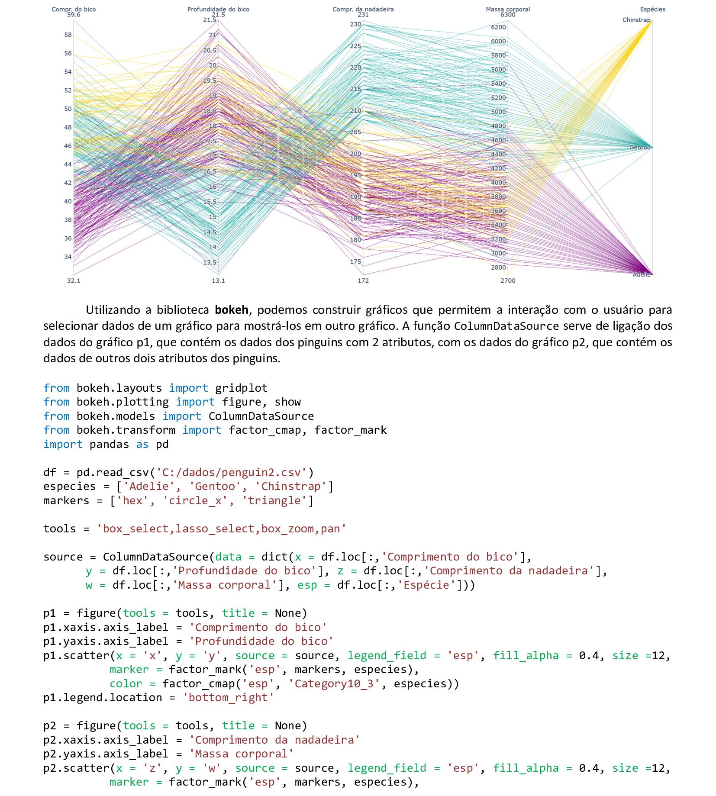
  
<a href="#modulo4" class="topo">voltar ao topo</a>

  
  

&#x1f4c3; Código

  <figcaption>Gráfico com seleção interativa:
<pre><code><a alt="biblioteca bokeh de gráficos interativos">from bokeh.layouts import gridplot</a>
from bokeh.plotting import figure, show
from bokeh.models import ColumnDataSource
from bokeh.transform import factor_cmap, factor_mark
import pandas as pd

df = pd.read_csv('C:/dados/penguin2.csv')
especies = ['Adelie', 'Gentoo', 'Chinstrap']
<a alt="marcador de cada espécie">markers =</a> ['hex', 'circle_x', 'triangle']

<a alt="ferramentas de interação">tools =</a> 'box_select,lasso_select,box_zoom,pan'

<a alt="separação de atributos">source =</a> ColumnDataSource(data = dict(x = df.loc[:,'Comprimento do bico'], 
	y = df.loc[:,'Profundidade do bico'], z = df.loc[:,'Comprimento da nadadeira'],
	w = df.loc[:,'Massa corporal'], esp = df.loc[:,'Espécie']))

p1 = figure(tools = tools, title = None)
p1.xaxis.axis_label = 'Comprimento do bico'
p1.yaxis.axis_label = 'Profundidade do bico'
<a alt="primeiro gráfico interativo de dispersão">p1.scatter</a>(x = 'x', y = 'y', source = source, legend_field = 'esp', fill_alpha = 0.4, size =12,
    marker = factor_mark('esp', markers, especies),
    color = factor_cmap('esp', 'Category10_3', especies))
p1.legend.location = 'bottom_right'

p2 = figure(tools = tools, title = None)
p2.xaxis.axis_label = 'Comprimento da nadadeira'
p2.yaxis.axis_label = 'Massa corporal'
<a alt="segundo gráfico interativo de dispersão">p2.scatter</a>(x = 'z', y = 'w', source = source, legend_field = 'esp', fill_alpha = 0.4, size =12,
    marker = factor_mark('esp', markers, especies),
    color = factor_cmap('esp', 'Category10_3', especies))
p2.legend.location = 'bottom_right'

p = gridplot([[p1, p2]])
show(p)
</code></pre></figcaption>
  

  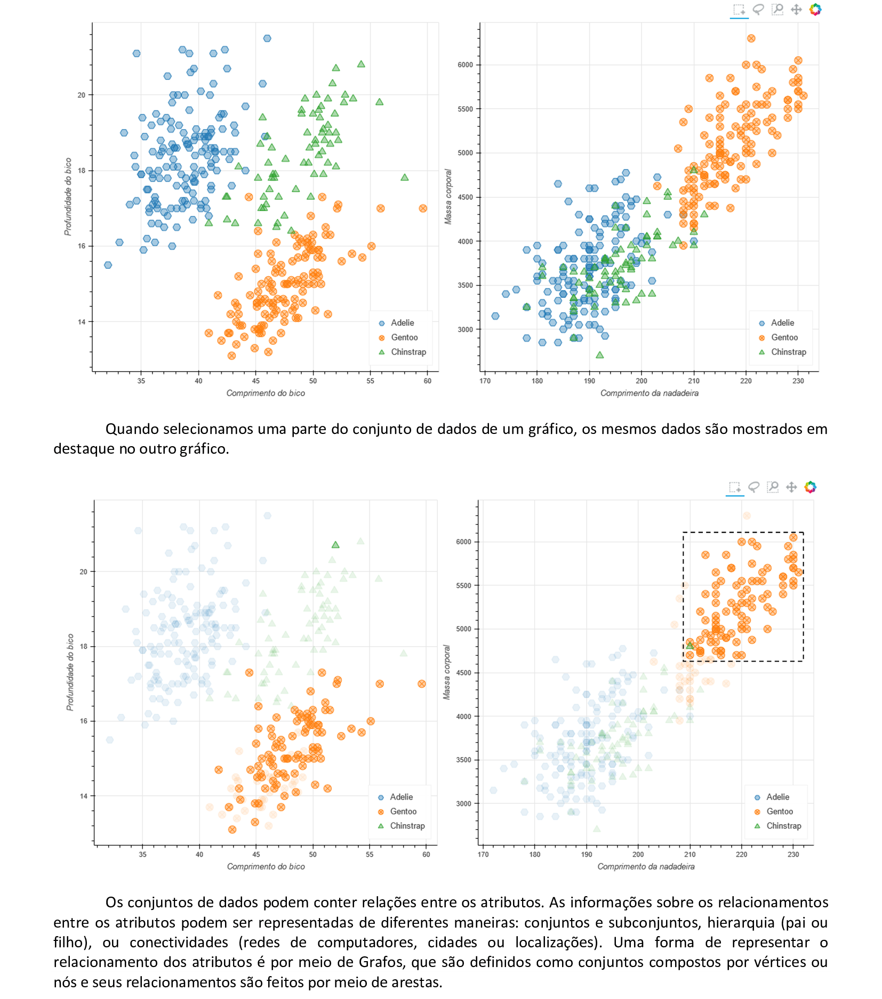
  
<a href="#modulo4" class="topo">voltar ao topo</a>

  
  
<a href="#modulo4" class="topo">voltar ao topo</a>

  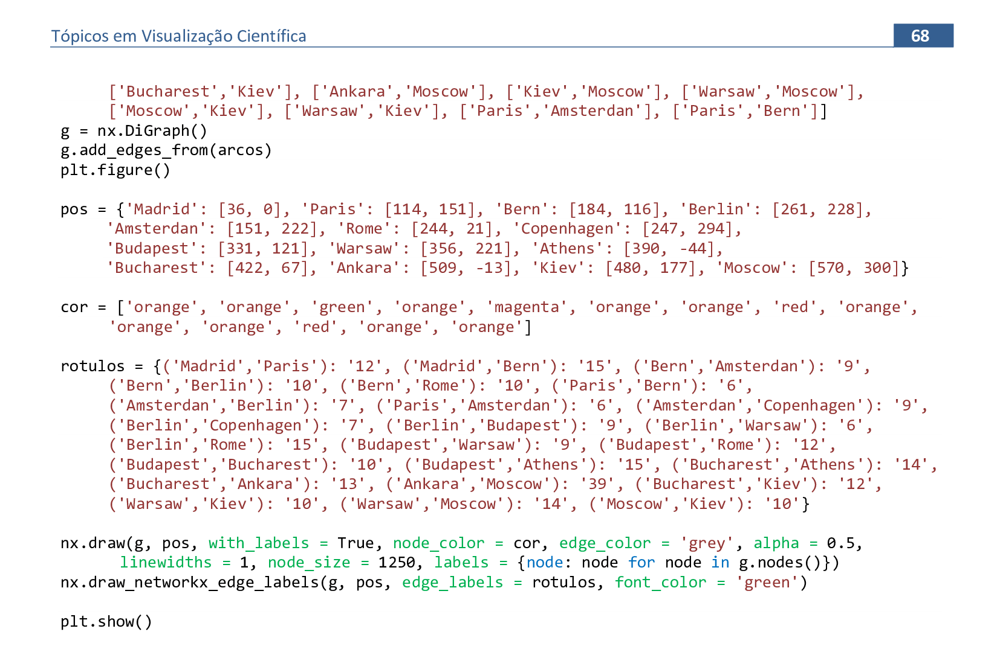
  

&#x1f4c3; Código

  <figcaption>Grafo orientado:
<pre><code><a alt="biblioteca networkx de grafos orientados">import networkx as nx</a>
import matplotlib.pyplot as plt

<a alt="definição dos arcos entre os nós">arcos =</a> [['Madrid','Paris'], ['Madrid','Bern'], ['Bern','Madrid'], ['Bern','Amsterdan'], ['Bern','Berlin'], ['Bern','Rome'], ['Amsterdan','Berlin'], ['Amsterdan','Copenhagen'], ['Berlin','Copenhagen'], ['Berlin','Budapest'],['Berlin','Warsaw'], ['Berlin','Rome'], ['Budapest','Warsaw'], ['Budapest','Rome'], ['Budapest','Athens'], ['Budapest','Bucharest'], ['Bucharest','Athens'], ['Bucharest','Ankara'], ['Bucharest','Kiev'], ['Ankara','Moscow'], ['Kiev','Moscow'], ['Warsaw','Moscow'], ['Moscow','Kiev'], ['Warsaw','Kiev'], ['Paris','Amsterdan'], ['Paris','Bern']]
g = <a alt="grafo orientado (direcionado)">nx.DiGraph()</a>
g.add_edges_from(arcos)
plt.figure()

<a alt="coordenadas de cada nó">pos =</a> {'Madrid': [36, 0], 'Paris': [114, 151], 'Bern': [184, 116], 'Berlin': [261, 228],
'Amsterdan': [151, 222], 'Rome': [244, 21], 'Copenhagen': [247, 294], 
'Budapest': [331, 121], 'Warsaw': [356, 221], 'Athens': [390, -44], 
'Bucharest': [422, 67], 'Ankara': [509, -13], 'Kiev': [480, 177], 'Moscow': [570, 300]}

<a alt="sequência das cores dos nós">cor =</a> ['orange', 'orange', 'green', 'orange', 'magenta', 'orange', 'orange', 'red', 'orange', 'orange', 'orange', 'red', 'orange', 'orange']

<a alt="rótulos dos valores dos arcos">rotulos =</a> {('Madrid','Paris'): '12', ('Madrid','Bern'): '15', ('Bern','Amsterdan'): '9', 
    ('Bern','Berlin'): '10', ('Bern','Rome'): '10', ('Paris','Bern'): '6', ('Amsterdan','Berlin'): '7', 
    ('Paris','Amsterdan'): '6', ('Amsterdan','Copenhagen'): '9', ('Berlin','Copenhagen'): '7',
    ('Berlin','Budapest'): '9', ('Berlin','Warsaw'): '6', ('Berlin','Rome'): '15', ('Budapest','Warsaw'): '9',
    ('Budapest','Rome'): '12', ('Budapest','Bucharest'): '10', ('Budapest','Athens'): '15',
    ('Bucharest','Athens'): '14', ('Bucharest','Ankara'): '13', ('Ankara','Moscow'): '39',
    ('Bucharest','Kiev'): '12', ('Warsaw','Kiev'): '10', ('Warsaw','Moscow'): '14', ('Moscow','Kiev'): '10'}

<a alt="comando para inserir os nós do grafo">nx.draw</a>(g, pos, with_labels = True, node_color = cor, edge_color = 'grey', alpha = 0.5, 
    linewidths = 1, node_size = 1250, labels = {node: node for node in g.nodes()})
<a alt="comando para inserir os rótulos dos arcos">nx.draw_networkx_edge_labels</a>(g, pos, edge_labels = rotulos, font_color = 'green')

plt.show()
</code></pre></figcaption>
  

  
  
<a href="#modulo4" class="topo">voltar ao topo</a>

  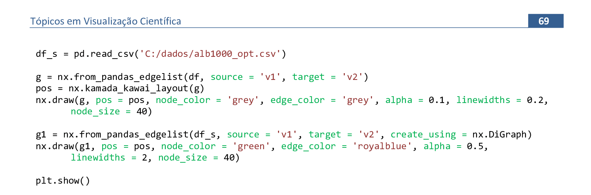
  
<a href="#modulo4" class="topo">voltar ao topo</a>

  
  
<a href="#modulo4" class="topo">voltar ao topo</a>

  
  
<a href="#modulo4" class="topo">voltar ao topo</a>

  
  
<a href="#modulo4" class="topo">voltar ao topo</a>

  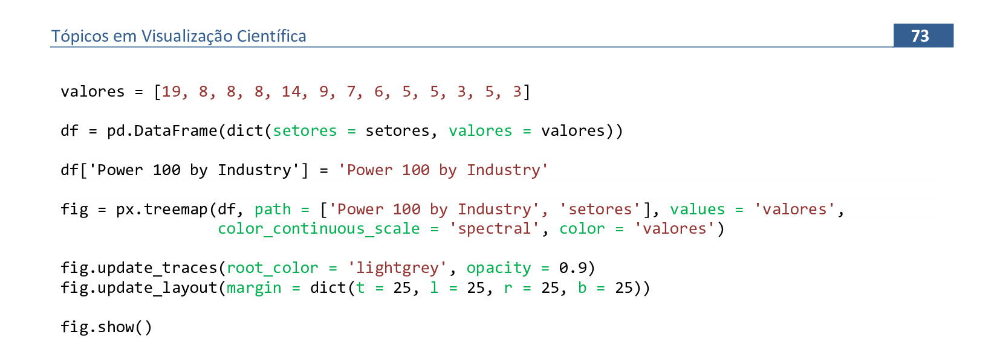
  
<a href="#modulo4" class="topo">voltar ao topo</a>

  
  
<a href="#modulo4" class="topo">voltar ao topo</a>

  
  
<a href="#modulo4" class="topo">voltar ao topo</a>

  
  
<a href="#modulo4" class="topo">voltar ao topo</a>

  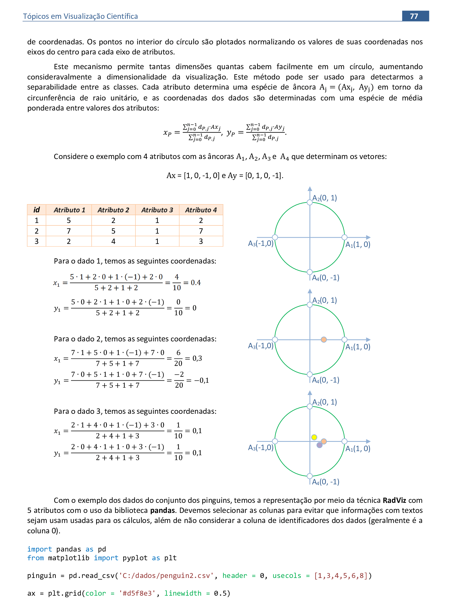
  
<a href="#modulo4" class="topo">voltar ao topo</a>

  
  
<a href="#modulo4" class="topo">voltar ao topo</a>

  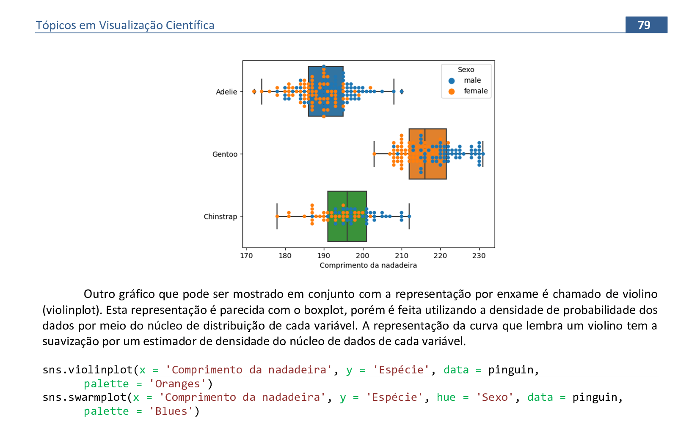
  
<a href="#modulo4" class="topo">voltar ao topo</a>

  
  
<a href="#modulo4" class="topo">voltar ao topo</a>

  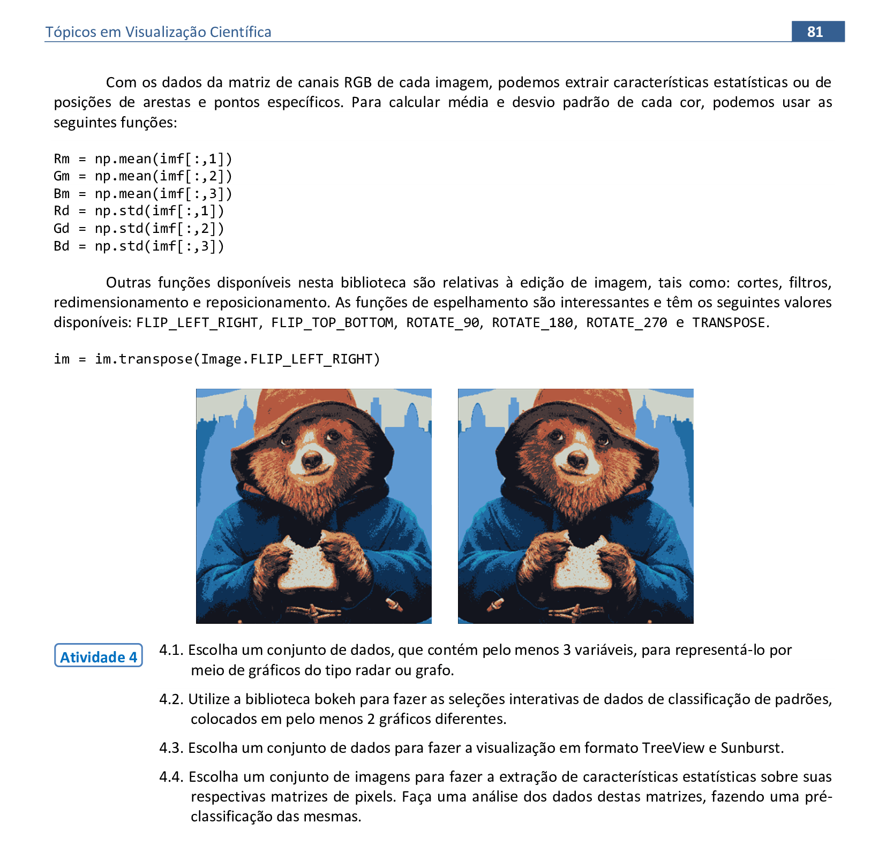
  
<a href="#modulo4" class="topo">voltar ao topo</a>

  
5. Linhas, polígonos, poliedros e superfícies

  
Material da página 81 até a página 92.

  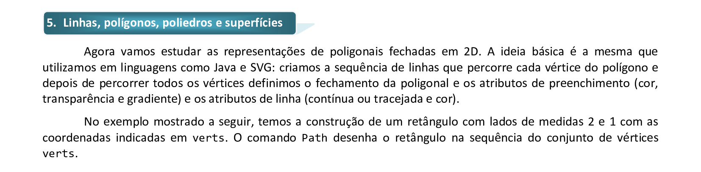
  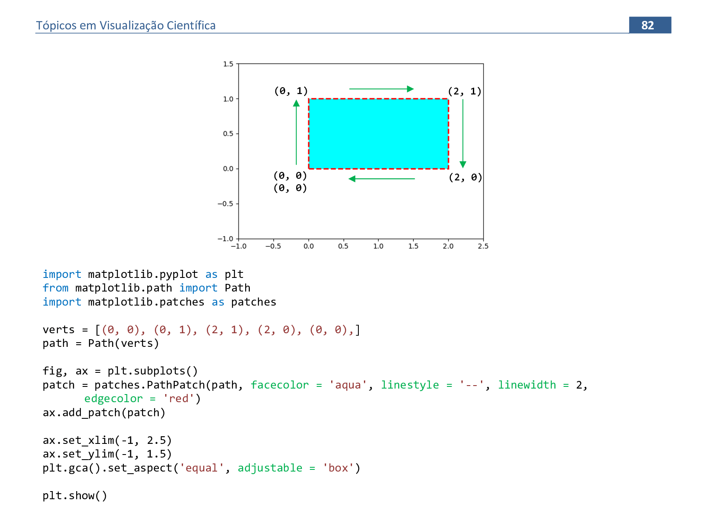
  
<a href="#modulo5" class="topo">voltar ao topo</a>

  
  
<a href="#modulo5" class="topo">voltar ao topo</a>

  
  
<a href="#modulo5" class="topo">voltar ao topo</a>

  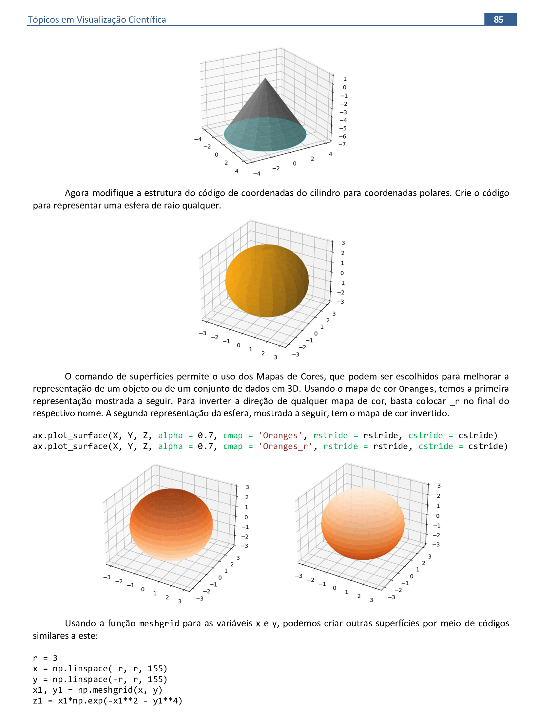
  
<a href="#modulo5" class="topo">voltar ao topo</a>

  
  
<a href="#modulo5" class="topo">voltar ao topo</a>

  
  
<a href="#modulo5" class="topo">voltar ao topo</a>

  
  
<a href="#modulo5" class="topo">voltar ao topo</a>

  
  
<a href="#modulo5" class="topo">voltar ao topo</a>

  
  
<a href="#modulo5" class="topo">voltar ao topo</a>

  
  
<a href="#modulo5" class="topo">voltar ao topo</a>

  
  
<a href="#modulo5" class="topo">voltar ao topo</a>

  
6. Modelos de iluminação

  
Material da página 92 até a página 105.

  
  
  
<a href="#modulo6" class="topo">voltar ao topo</a>

  
  
<a href="#modulo6" class="topo">voltar ao topo</a>

  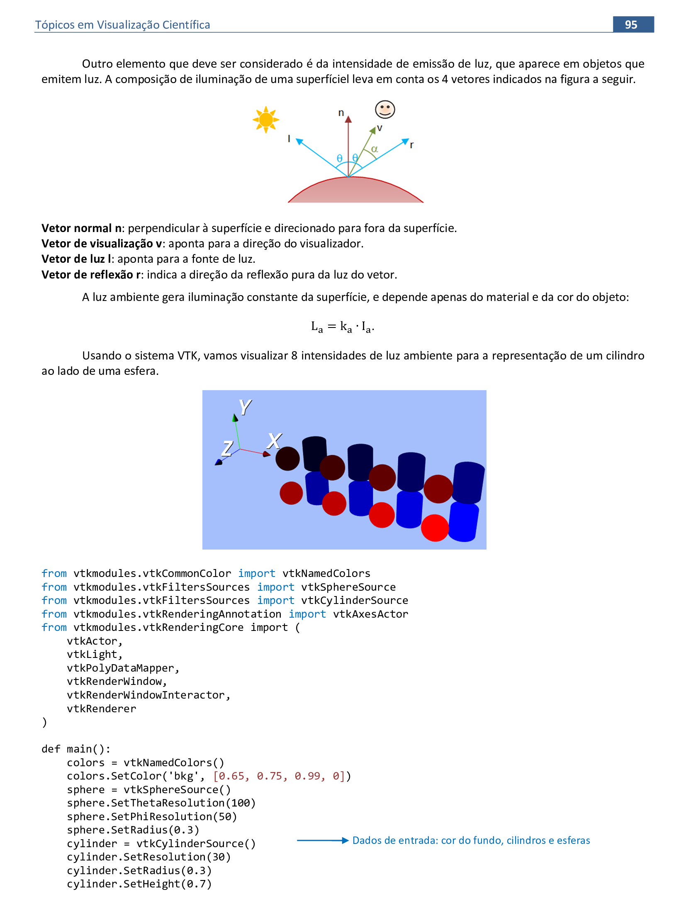
  
<a href="#modulo6" class="topo">voltar ao topo</a>

  
  
<a href="#modulo6" class="topo">voltar ao topo</a>

  
  
<a href="#modulo6" class="topo">voltar ao topo</a>

  
  
<a href="#modulo6" class="topo">voltar ao topo</a>

  
  
<a href="#modulo6" class="topo">voltar ao topo</a>

  
  
<a href="#modulo6" class="topo">voltar ao topo</a>

  
  
<a href="#modulo6" class="topo">voltar ao topo</a>

  
  
<a href="#modulo6" class="topo">voltar ao topo</a>

  
  
<a href="#modulo6" class="topo">voltar ao topo</a>

  
  
<a href="#modulo6" class="topo">voltar ao topo</a>

  
  
<a href="#modulo6" class="topo">voltar ao topo</a>

  
7. Câmera

  
Material da página 105 até a página 114.

  
  
  
<a href="#modulo7" class="topo">voltar ao topo</a>

  
  
<a href="#modulo7" class="topo">voltar ao topo</a>

  
  
<a href="#modulo7" class="topo">voltar ao topo</a>

  
  
<a href="#modulo7" class="topo">voltar ao topo</a>

  
  
<a href="#modulo7" class="topo">voltar ao topo</a>

  
  
<a href="#modulo7" class="topo">voltar ao topo</a>

  
  
<a href="#modulo7" class="topo">voltar ao topo</a>

  
  
<a href="#modulo7" class="topo">voltar ao topo</a>

  
  
<a href="#modulo7" class="topo">voltar ao topo</a>

  
8. Realidade Virtual

  
Material da página 115 até a página 144.

  
  
<a href="#modulo8" class="topo">voltar ao topo</a>

  
  
<a href="#modulo8" class="topo">voltar ao topo</a>

  
  
<a href="#modulo8" class="topo">voltar ao topo</a>

  
  
<a href="#modulo8" class="topo">voltar ao topo</a>

  
  
<a href="#modulo8" class="topo">voltar ao topo</a>

  
  
<a href="#modulo8" class="topo">voltar ao topo</a>

  
  
<a href="#modulo8" class="topo">voltar ao topo</a>

  
  
<a href="#modulo8" class="topo">voltar ao topo</a>

  
  
<a href="#modulo8" class="topo">voltar ao topo</a>

  
  
<a href="#modulo8" class="topo">voltar ao topo</a>

  
  
<a href="#modulo8" class="topo">voltar ao topo</a>

  
  
<a href="#modulo8" class="topo">voltar ao topo</a>

  
  
<a href="#modulo8" class="topo">voltar ao topo</a>

  
  
<a href="#modulo8" class="topo">voltar ao topo</a>

  
  
<a href="#modulo8" class="topo">voltar ao topo</a>

  
  
<a href="#modulo8" class="topo">voltar ao topo</a>

  
  
<a href="#modulo8" class="topo">voltar ao topo</a>

  
  
<a href="#modulo8" class="topo">voltar ao topo</a>

  
  
<a href="#modulo8" class="topo">voltar ao topo</a>

  
  
<a href="#modulo8" class="topo">voltar ao topo</a>

  
  
<a href="#modulo8" class="topo">voltar ao topo</a>

  
  
<a href="#modulo8" class="topo">voltar ao topo</a>

  
  
<a href="#modulo8" class="topo">voltar ao topo</a>

  
  
<a href="#modulo8" class="topo">voltar ao topo</a>

  
  
<a href="#modulo8" class="topo">voltar ao topo</a>

  
  
<a href="#modulo8" class="topo">voltar ao topo</a>

  
  
<a href="#modulo8" class="topo">voltar ao topo</a>

  
  
<a href="#modulo8" class="topo">voltar ao topo</a>

  
  
<a href="#modulo8" class="topo">voltar ao topo</a>

  
  
<a href="#modulo8" class="topo">voltar ao topo</a>

  
9. Realidade Aumentada

  
Material da página 144 até a página 152.

  
  
  
<a href="#modulo9" class="topo">voltar ao topo</a>

  
  
<a href="#modulo9" class="topo">voltar ao topo</a>

  
  
<a href="#modulo9" class="topo">voltar ao topo</a>

  
  
<a href="#modulo9" class="topo">voltar ao topo</a>

  
  
<a href="#modulo9" class="topo">voltar ao topo</a>

  
  
<a href="#modulo9" class="topo">voltar ao topo</a>

  
  
<a href="#modulo9" class="topo">voltar ao topo</a>

  
  
<a href="#modulo9" class="topo">voltar ao topo</a>

<h4>página desenvolvida por:</h4> 

Paulo Henrique Siqueira
  

<b>contato:</b> paulohscwb@gmail.com 

<h4>O desenvolvimento deste material faz parte do Grupo de Estudos em Expressão Gráfica (GEEGRAF) da Universidade Federal do Paraná (UFPR)</h4>  

 Visualização Científica de <a xmlns:cc="http://creativecommons.org/ns#" href="https://paulohscwb.github.io/visualizacao-cientifica/" property="cc:attributionName" rel="cc:attributionURL">Paulo Henrique Siqueira</a> está licenciado com uma Licença <a rel="license" href="http://creativecommons.org/licenses/by-nc-nd/4.0/">Creative Commons Atribuição-NãoComercial-SemDerivações 4.0 Internacional</a>.

<h4>Como citar este trabalho:</h4> 

Siqueira, P.H., "Visualização Científica". Disponível em: <https://paulohscwb.github.io/visualizacao-cientifica/>, Agosto de 2022.

<h4>Referências:</h4>
<ol>
	<li>A-frame. A web framework for building 3D/AR/VR experiences. Disponível em: <https://aframe.io/>, 2022.</li>
	<li>Anscombe, F. J. Graphs in Statistical Analysis. American Statistician, vol. 27, n. 1, p. 17–21, 1973.</li>
	<li>Card, S. K., Mackinlay, J. D., Shneiderman, B. Readings in Information Visualization Using Vision to Think. San Francisco: Browse books, 1999.</li>
	<li>Eler, D. M. Visualização de Informação. Disponível em: <https://daniloeler.github.io/teaching/VISUALIZACAO>, 2020.</li>
	<li>Horst, A. M., Hill, A. P., Gorman, K. B. Palmerpenguins: Palmer Archipelago (Antarctica) penguin data. Disponível em: <https://allisonhorst.github.io/palmerpenguins/>. doi: 10.5281/zenodo.3960218, 2020.</li>
	<li>Keim, D. A. Information Visualization and Visual Data Mining. IEEE Transactions on Visualization and Computer Graphics, vol. 8, n. 1, p. 1–8, 2002.</li>
	<li>Keller, P. R, Keller, M. M. Visual Cues: Pratical Data Visualization. Los Alamitos, CA: IEEE Computer Society Press, 1994.</li>
	<li>Moro, C. et al. The effectiveness of virtual and augmented reality in health sciences and medical anatomy. Anatomical sciences education, v. 10, n. 6, p. 549–559, 2017.</li>
	<li>Siqueira, P. H. Desenvolvimento de ambientes web em Realidade Aumentada e Realidade Virtual para estudos de superfícies topográficas. Revista Brasileira de Expressão Gráfica, v. 7, n. 2, p. 21–44, 2019.</li>
	<li>Shneiderman, B. The eyes have it: a task by data type taxonomy for information visualization. In: Proceedings of the 1996, IEEE Symposium on Visual Languages, p. 336–343. Washington, DC: IEEE Computer Society, 1996.</li>
	<li>Telea, A. C. Data visualization: principles and practice. Boca Raton: CRC Press, 2015.</li>
	<li>Ward, M., Grinstein, G.G., Keim, D. Interactive data visualization foundations, techniques, and applications. Massachusetts: A K Peters, 2010.</li>
	<li>Williams, J. G., Sochats, K. M., Morse, E. Visualization. Annual Review of Information Science and Technology (ARIST), v. 30, p. 161–207, 1995.</li>
<ol>
