<link rel="stylesheet" href="imagens/style.css">

<h2 id="inicio">Códigos, algoritmos, exemplos e aplicações</h2>

Esta página contém os códigos, algoritmos e exemplos das técnicas mostradas na disciplina de Visualização Científica.

A apostila está disponível no link: <a href="modulo1/apostila_2022.pdf" target="_blank">apostila de Visualização Científica</a>

  
1. Introdução

  
Material da página 1 até a página 14.

   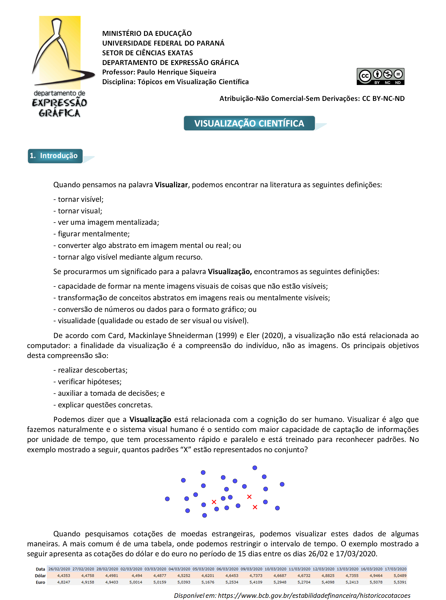
   
<a href="#modulo1" class="topo">voltar ao topo</a>

   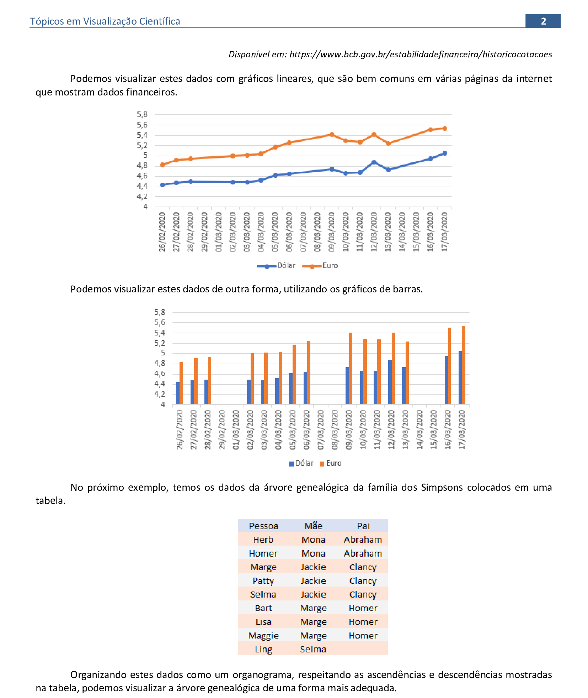
   
<a href="#modulo1" class="topo">voltar ao topo</a>

   
   
<a href="#modulo1" class="topo">voltar ao topo</a>

   
   
<a href="#modulo1" class="topo">voltar ao topo</a>

   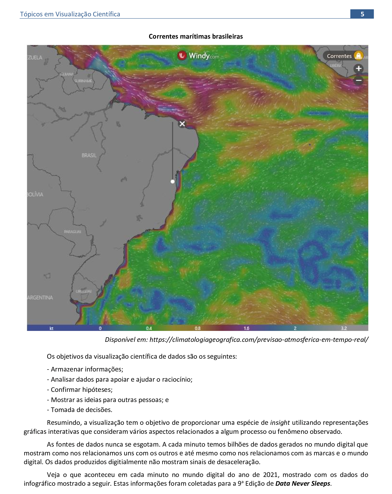
   
<a href="#modulo1" class="topo">voltar ao topo</a>

   
   
<a href="#modulo1" class="topo">voltar ao topo</a>

   
   
<a href="#modulo1" class="topo">voltar ao topo</a>

   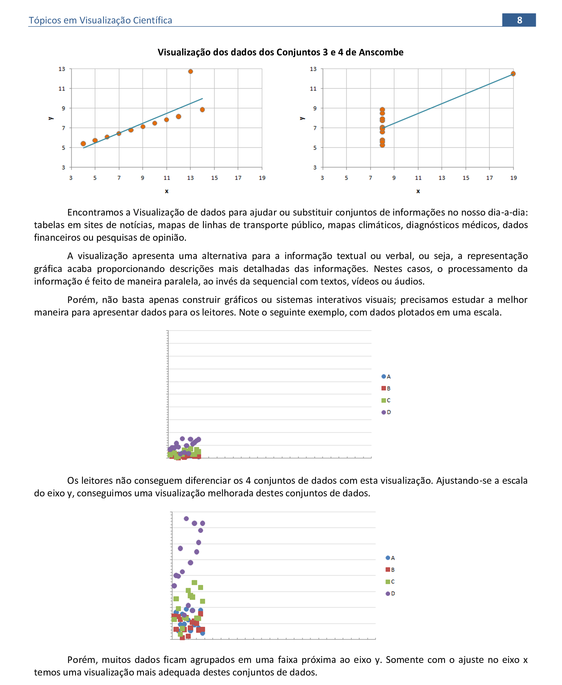
   
<a href="#modulo1" class="topo">voltar ao topo</a>

   
   

&#x1f4c3; Algoritmo comentado

   <figcaption>Algoritmo da Rede Neural Perceptron:
<pre><code>0. Inicializar os pesos, o bias e a taxa de aprendizado: <a alt="vetor de pesos">w = 0</a>, <a alt="bias">&theta; = 0</a>, <a alt="taxa de aprendizagem">&alpha; = 1</a> 
    1. Enquanto o <a alt="critérios de parada mais usados:&#10;número máximo de iterações, erro mínimo alcançado,&#10;ou número máximo de iterações sem modificações nos pesos">critério de parada</a> não for satisfeito, execute os passos 2-6:
        2. <a alt="cada par de treinamento deve ser apresentado à rede">Para cada par de dados de treinamento (x,d)</a>, execute os passos 3-5:
        3. <a alt="calculamos o valor da variável y* sem a função de ativação">Calcule y* = &theta; + &sum;ixiwi</a> 
        4. <a alt="Neste passo, calculamos a função de ativação em y*">Se y* &gt; &delta;, então y = 1</a> 
            Se -&delta; ≤ y* ≤ &delta;, então y = 0
            Se y* &lt; -&delta;, então y = -1 
        5. <a alt="A atualização dos pesos só é feita quando a rede erra a classificação">Atualize os pesos e a tendência:</a>
            Se y ≠ d, faça
               wiatual = wianterior + &alpha;dxi e &theta;atual = &theta;anterior + &alpha;d 
            Caso contrário
               wiatual = wianterior e &theta;atual = &theta;anterior
6. <a alt="Neste passo, podemos calcular o erro quantitativo da rede">Teste a condição de parada.</a>

</code></pre></figcaption>
   

   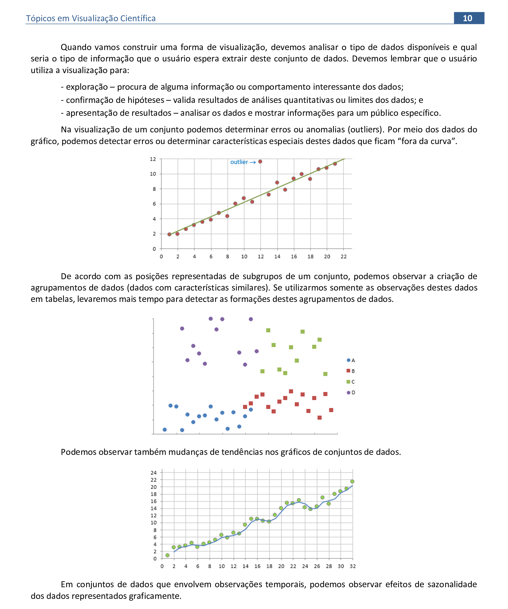
   
<a href="#modulo1" class="topo">voltar ao topo</a>

   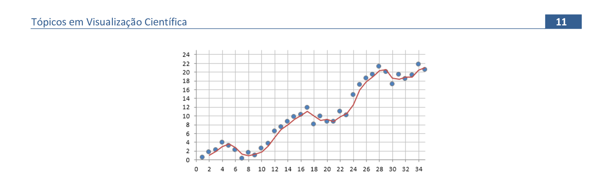
   
<a href="#modulo1" class="topo">voltar ao topo</a>

   
   
<a href="#modulo1" class="topo">voltar ao topo</a>

   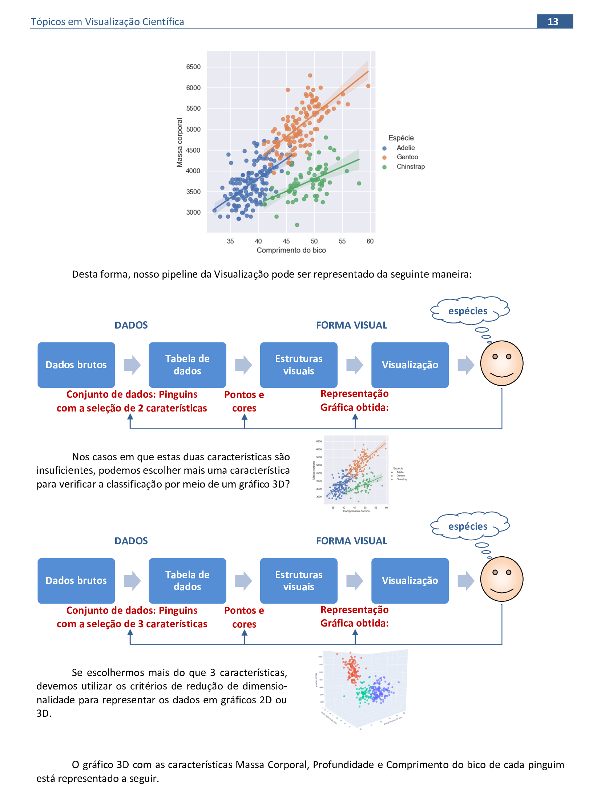
   
<a href="#modulo1" class="topo">voltar ao topo</a>

   

  
2. Conceitos básicos e estruturais de visualização

  
Material da página 14 até a página 24.

  
  
<a href="#modulo2" class="topo">voltar ao topo</a>

  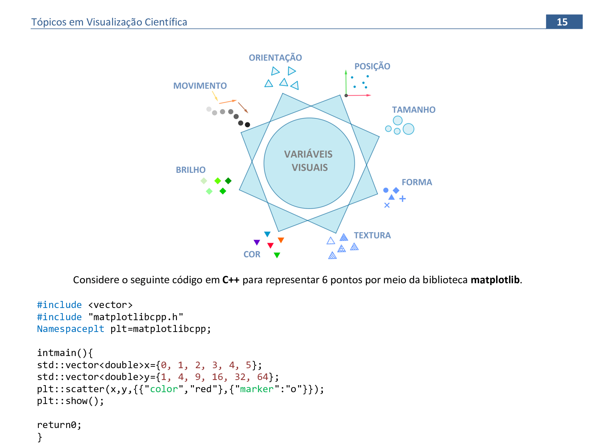
  
<a href="#modulo2" class="topo">voltar ao topo</a>

  
  
<a href="#modulo2" class="topo">voltar ao topo</a>

  
  
<a href="#modulo2" class="topo">voltar ao topo</a>

  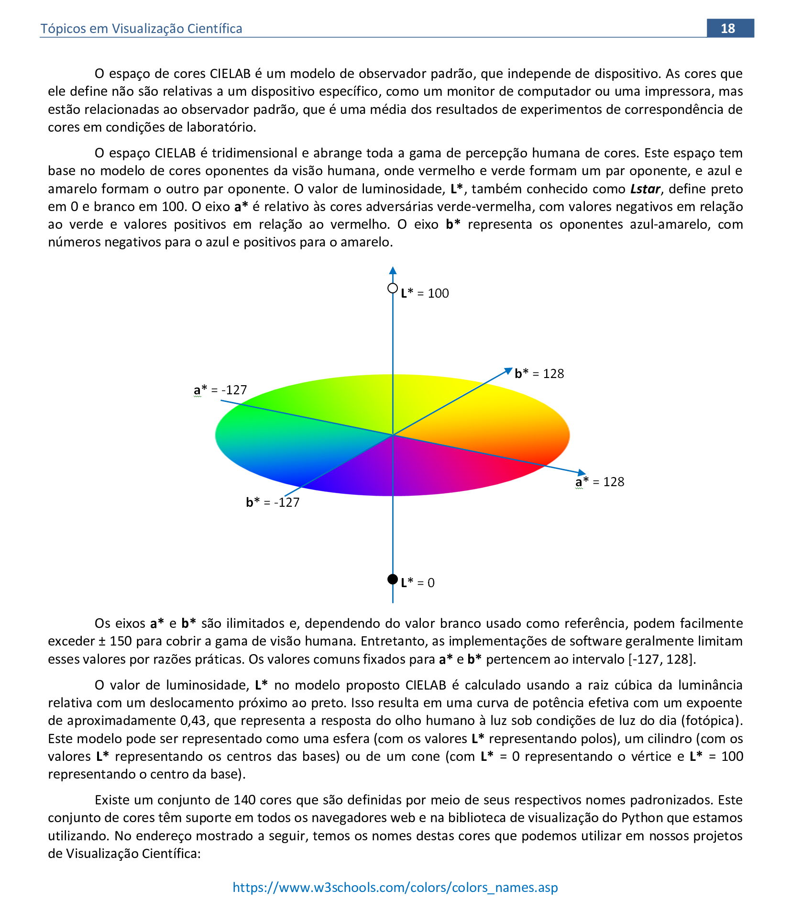
  
<a href="#modulo2" class="topo">voltar ao topo</a>

  
  
<a href="#modulo2" class="topo">voltar ao topo</a>

  
  
<a href="#modulo2" class="topo">voltar ao topo</a>

  
  
<a href="#modulo2" class="topo">voltar ao topo</a>

  
  
<a href="#modulo2" class="topo">voltar ao topo</a>

  
  
<a href="#modulo2" class="topo">voltar ao topo</a>

  
  
<a href="#modulo2" class="topo">voltar ao topo</a>

  
3. Fundamentos dos dados

  
Material da página 24 até a página 54.

  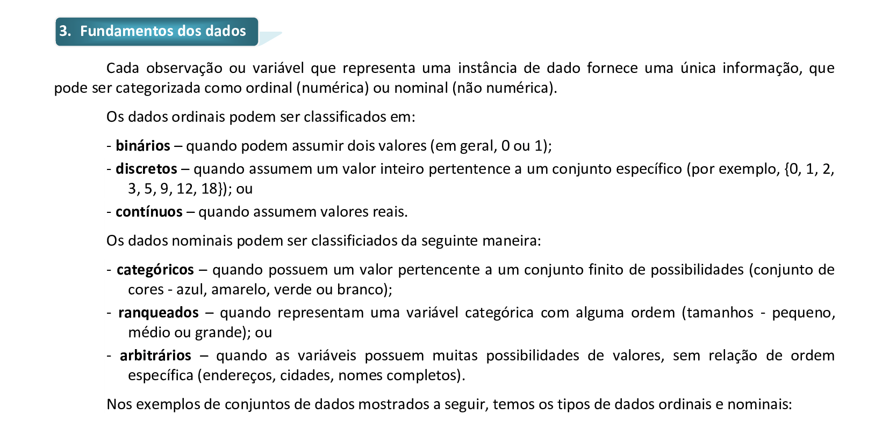
  
<a href="#modulo3" class="topo">voltar ao topo</a>

  
  
<a href="#modulo3" class="topo">voltar ao topo</a>

  
  
<a href="#modulo3" class="topo">voltar ao topo</a>

  
  
<a href="#modulo3" class="topo">voltar ao topo</a>

  
  
<a href="#modulo3" class="topo">voltar ao topo</a>

  
  
<a href="#modulo3" class="topo">voltar ao topo</a>

  
  
<a href="#modulo3" class="topo">voltar ao topo</a>

  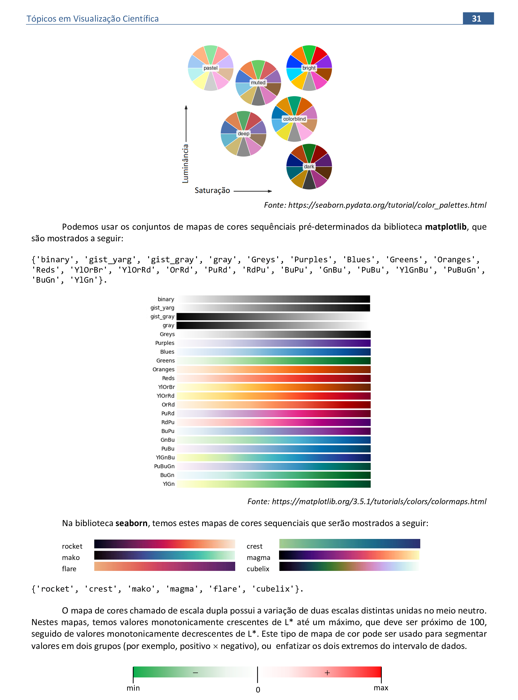
  
<a href="#modulo3" class="topo">voltar ao topo</a>

  
  
<a href="#modulo3" class="topo">voltar ao topo</a>

  
  
<a href="#modulo3" class="topo">voltar ao topo</a>

  
  
<a href="#modulo3" class="topo">voltar ao topo</a>

  
  
<a href="#modulo3" class="topo">voltar ao topo</a>

  
  
<a href="#modulo3" class="topo">voltar ao topo</a>

  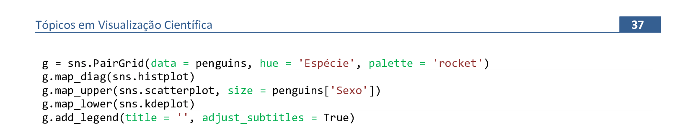
  
<a href="#modulo3" class="topo">voltar ao topo</a>

  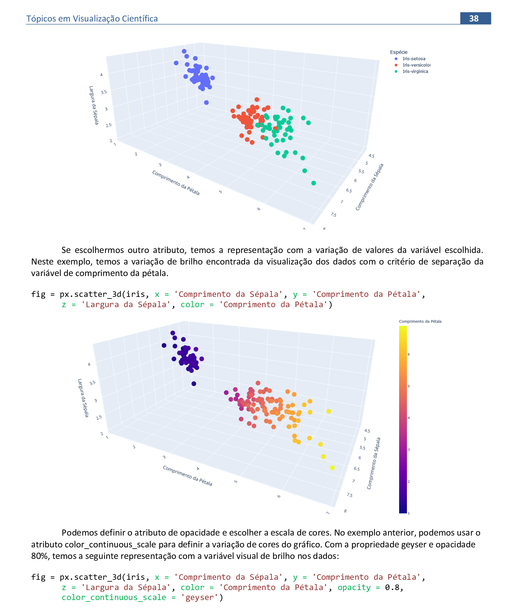
  
<a href="#modulo3" class="topo">voltar ao topo</a>

  
  
<a href="#modulo3" class="topo">voltar ao topo</a>

  
  
<a href="#modulo3" class="topo">voltar ao topo</a>

  
  
<a href="#modulo3" class="topo">voltar ao topo</a>

  
  
<a href="#modulo3" class="topo">voltar ao topo</a>

  
  
<a href="#modulo3" class="topo">voltar ao topo</a>

  
  
<a href="#modulo3" class="topo">voltar ao topo</a>

  
  
<a href="#modulo3" class="topo">voltar ao topo</a>

  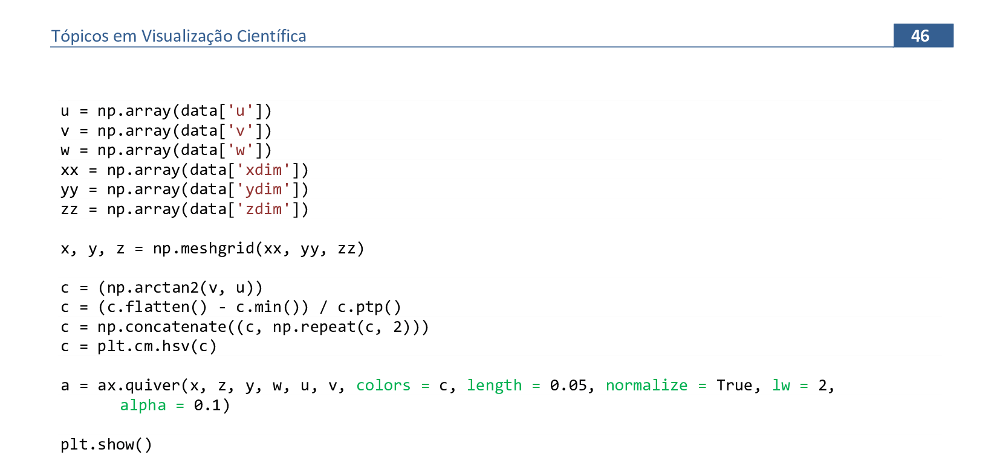
  
<a href="#modulo3" class="topo">voltar ao topo</a>

  
  
<a href="#modulo3" class="topo">voltar ao topo</a>

  
  
<a href="#modulo3" class="topo">voltar ao topo</a>

  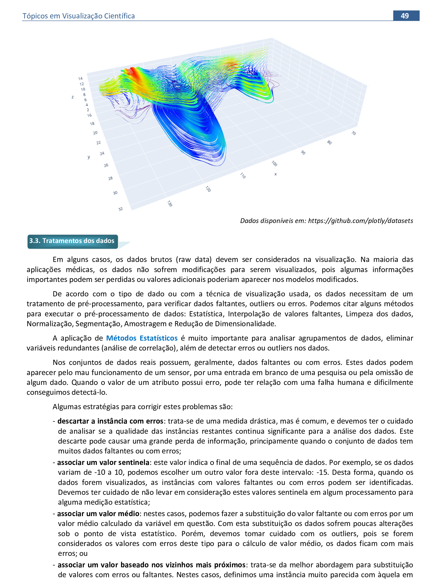
  
<a href="#modulo3" class="topo">voltar ao topo</a>

  
  
<a href="#modulo3" class="topo">voltar ao topo</a>

  
  
<a href="#modulo3" class="topo">voltar ao topo</a>

  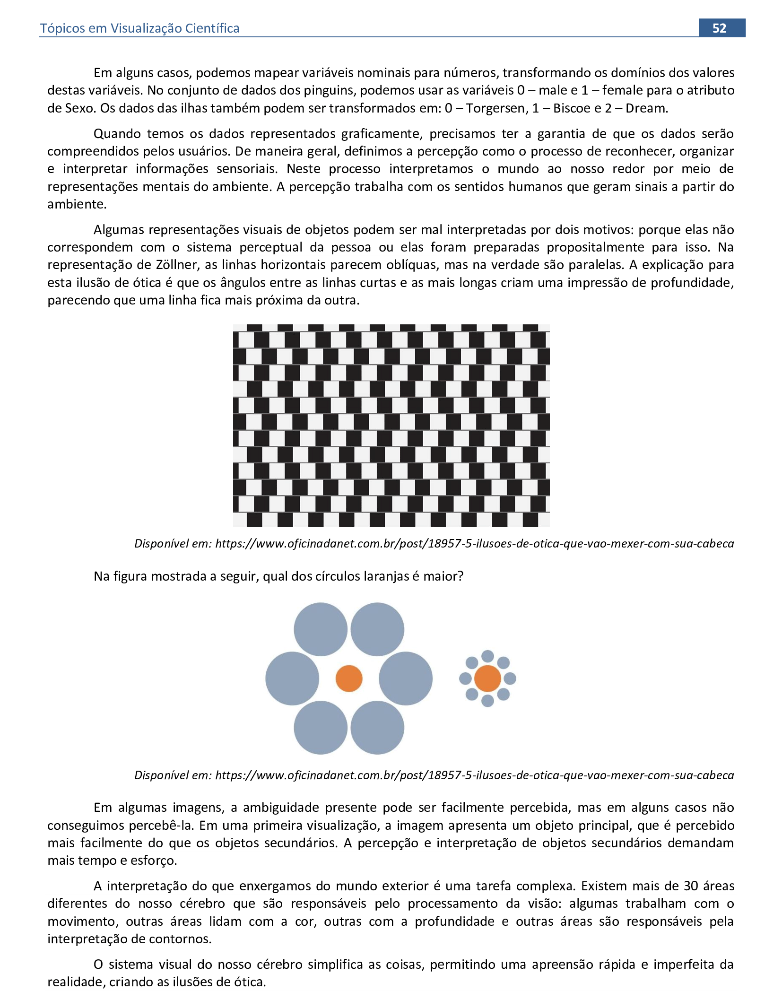
  
<a href="#modulo3" class="topo">voltar ao topo</a>

  
  
<a href="#modulo3" class="topo">voltar ao topo</a>

  
  
<a href="#modulo3" class="topo">voltar ao topo</a>

  
4. Taxonomia dos dados

  
Material da página 54 até a página 81.

  
  
<a href="#modulo4" class="topo">voltar ao topo</a>

  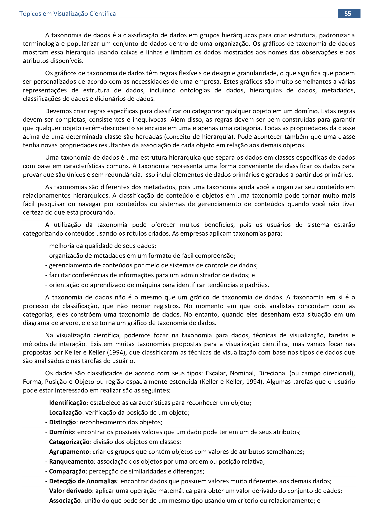
  
<a href="#modulo4" class="topo">voltar ao topo</a>

  
  
<a href="#modulo4" class="topo">voltar ao topo</a>

  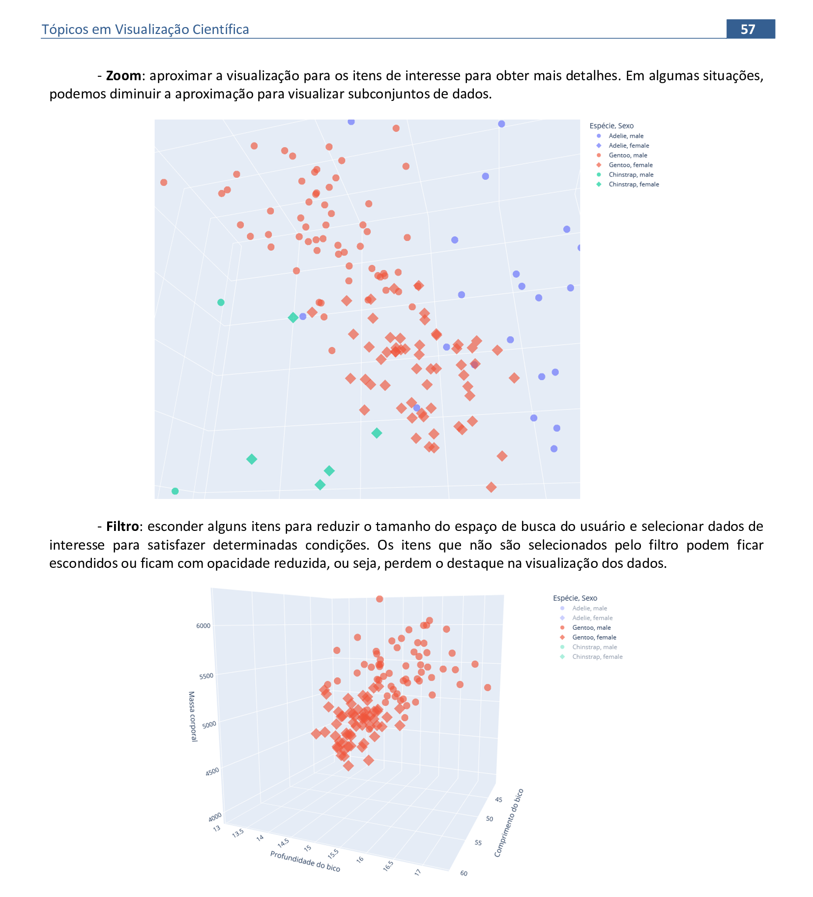
  
<a href="#modulo4" class="topo">voltar ao topo</a>

  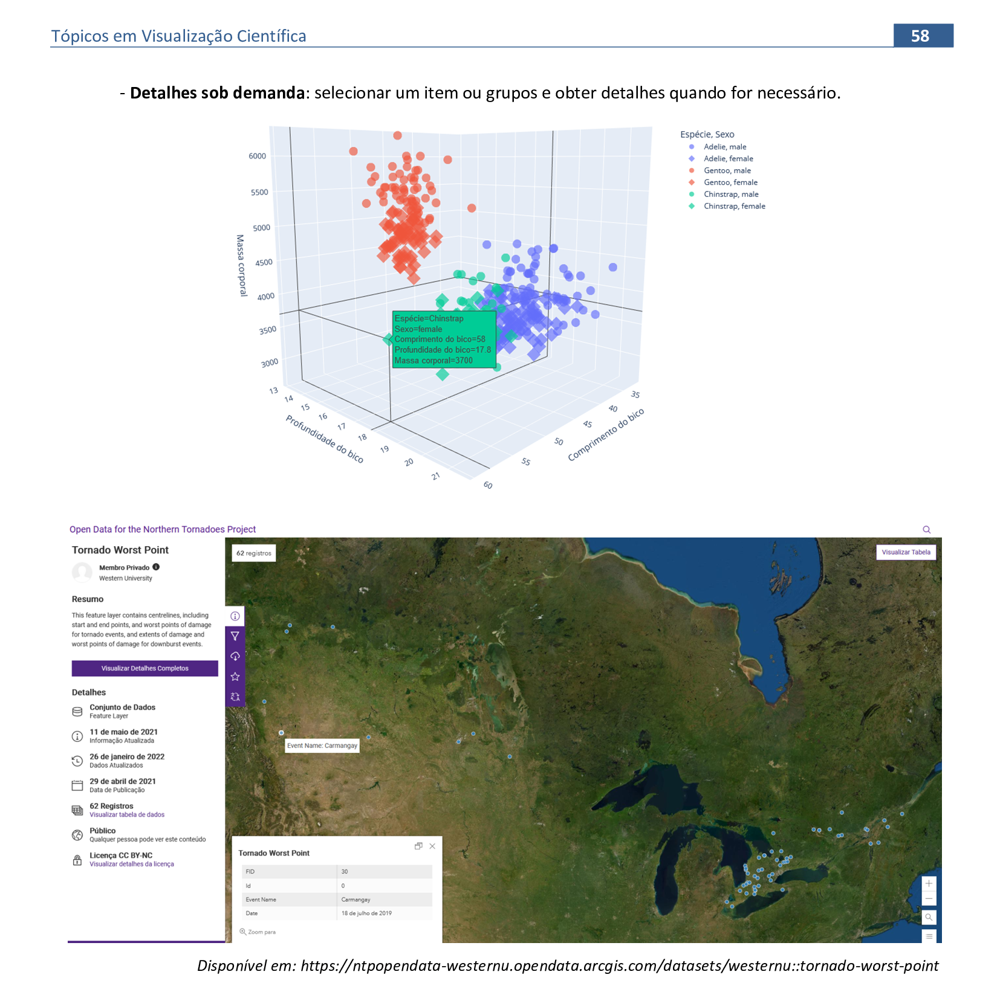
  
<a href="#modulo4" class="topo">voltar ao topo</a>

  
  
<a href="#modulo4" class="topo">voltar ao topo</a>

  
  
<a href="#modulo4" class="topo">voltar ao topo</a>

  
  
<a href="#modulo4" class="topo">voltar ao topo</a>

  
  
<a href="#modulo4" class="topo">voltar ao topo</a>

  
  
<a href="#modulo4" class="topo">voltar ao topo</a>

  
  
<a href="#modulo4" class="topo">voltar ao topo</a>

  
  
<a href="#modulo4" class="topo">voltar ao topo</a>

  
  
<a href="#modulo4" class="topo">voltar ao topo</a>

  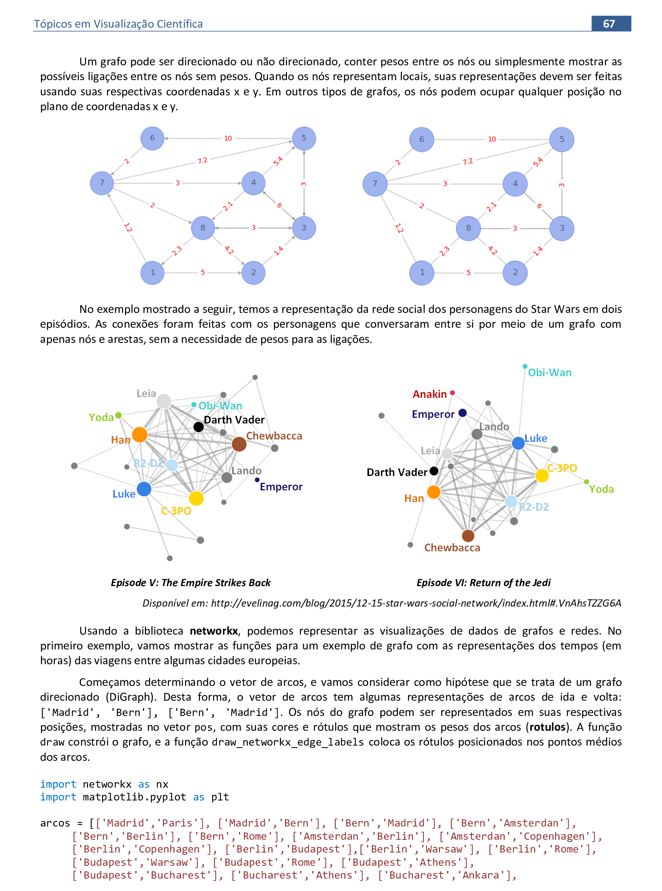
  
<a href="#modulo4" class="topo">voltar ao topo</a>

  
  
<a href="#modulo4" class="topo">voltar ao topo</a>

  
  
<a href="#modulo4" class="topo">voltar ao topo</a>

  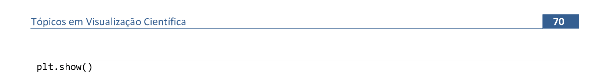
  
<a href="#modulo4" class="topo">voltar ao topo</a>

  
  
<a href="#modulo4" class="topo">voltar ao topo</a>

  
  
<a href="#modulo4" class="topo">voltar ao topo</a>

  
  
<a href="#modulo4" class="topo">voltar ao topo</a>

  
  
<a href="#modulo4" class="topo">voltar ao topo</a>

  
  
<a href="#modulo4" class="topo">voltar ao topo</a>

  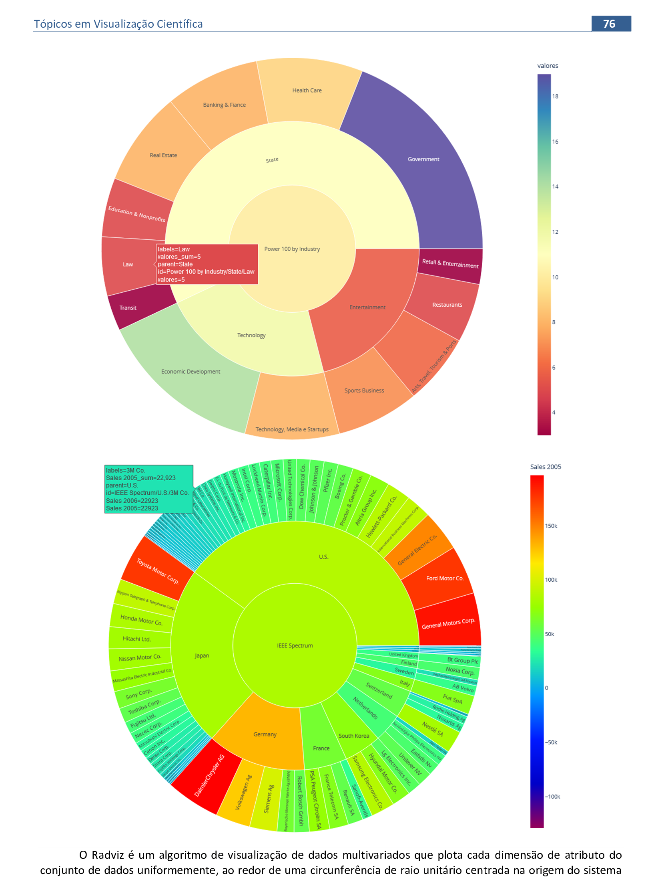
  
<a href="#modulo4" class="topo">voltar ao topo</a>

  
  
<a href="#modulo4" class="topo">voltar ao topo</a>

  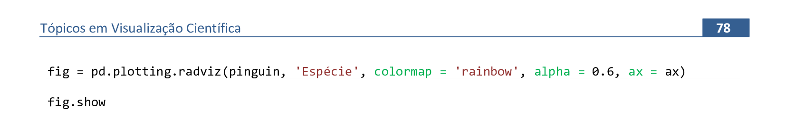
  
<a href="#modulo4" class="topo">voltar ao topo</a>

  
  
<a href="#modulo4" class="topo">voltar ao topo</a>

  
  
<a href="#modulo4" class="topo">voltar ao topo</a>

  

  
5. Linhas, polígonos, poliedros e superfícies

  
Material da página 81 até a página 92.

  
  
<a href="#modulo5" class="topo">voltar ao topo</a>

  
  
<a href="#modulo5" class="topo">voltar ao topo</a>

  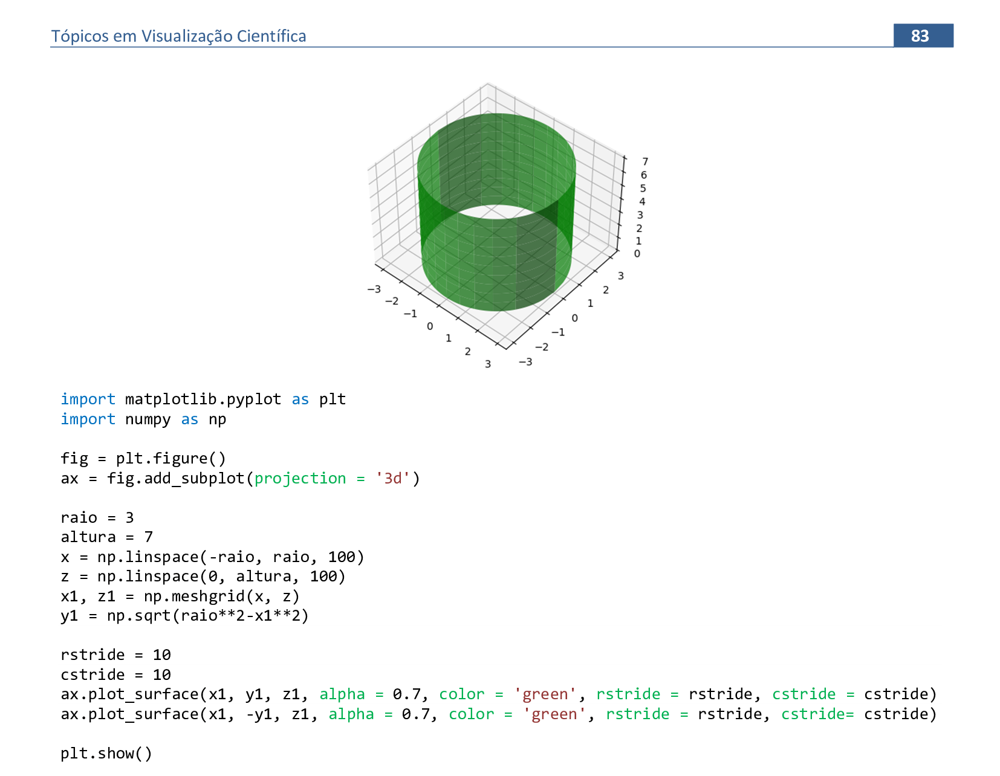
  
<a href="#modulo5" class="topo">voltar ao topo</a>

  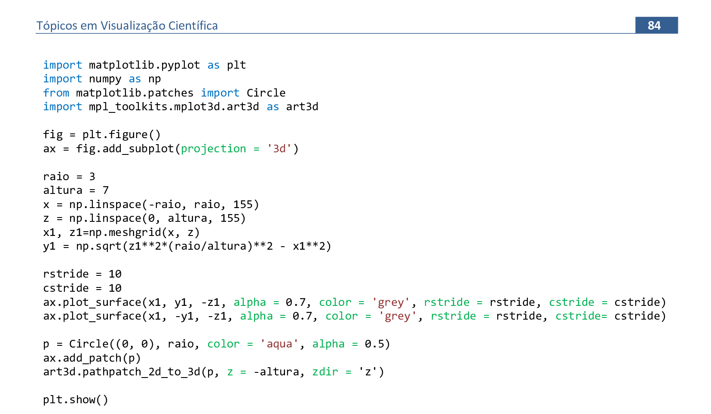
  
<a href="#modulo5" class="topo">voltar ao topo</a>

  
  
<a href="#modulo5" class="topo">voltar ao topo</a>

  
  
<a href="#modulo5" class="topo">voltar ao topo</a>

  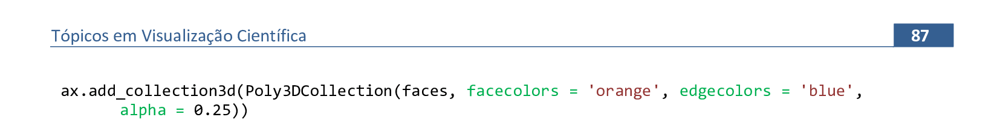
  
<a href="#modulo5" class="topo">voltar ao topo</a>

  
  
<a href="#modulo5" class="topo">voltar ao topo</a>

  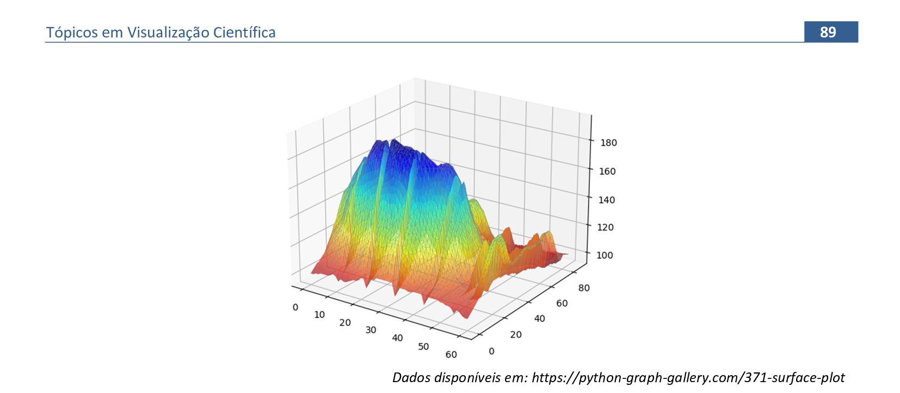
  
<a href="#modulo5" class="topo">voltar ao topo</a>

  
  
<a href="#modulo5" class="topo">voltar ao topo</a>

  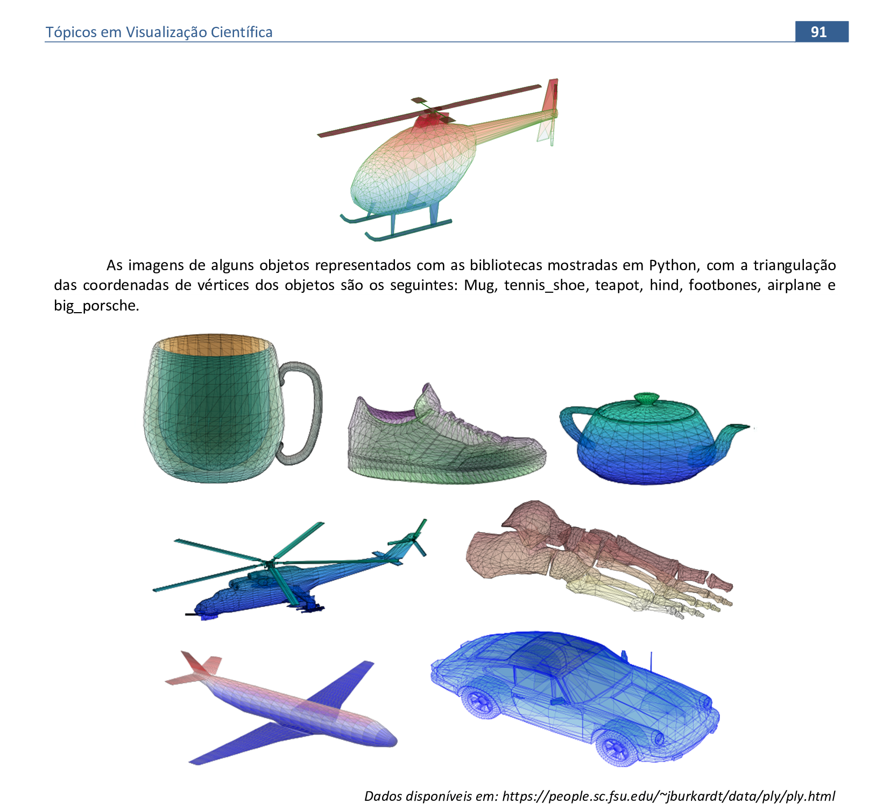
  
<a href="#modulo5" class="topo">voltar ao topo</a>

  
  
<a href="#modulo5" class="topo">voltar ao topo</a>

modulo6

  
6. Modelos de iluminação

  
Material da página 92 até a página 105.

  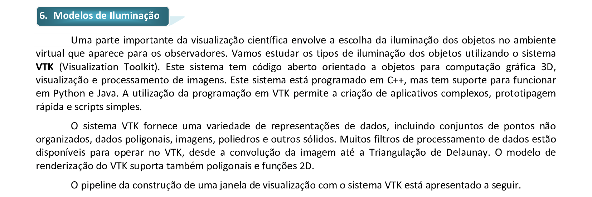
  
<a href="#modulo6" class="topo">voltar ao topo</a>

  
  
<a href="#modulo6" class="topo">voltar ao topo</a>

  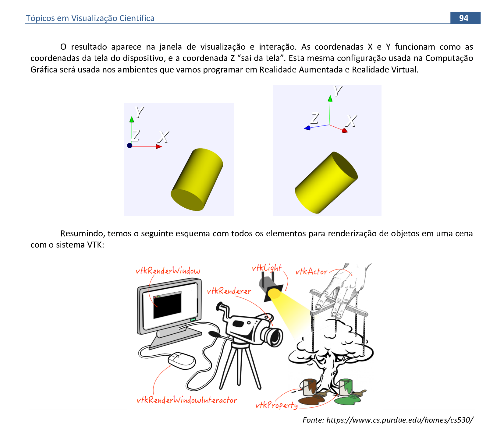
  
<a href="#modulo6" class="topo">voltar ao topo</a>

  
  
<a href="#modulo6" class="topo">voltar ao topo</a>

  
  
<a href="#modulo6" class="topo">voltar ao topo</a>

  
  
<a href="#modulo6" class="topo">voltar ao topo</a>

  
  
<a href="#modulo6" class="topo">voltar ao topo</a>

  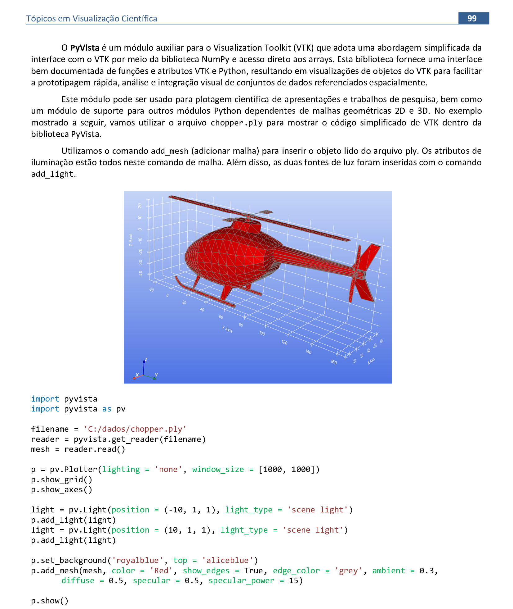
  
<a href="#modulo6" class="topo">voltar ao topo</a>

  
  
<a href="#modulo6" class="topo">voltar ao topo</a>

  
  
<a href="#modulo6" class="topo">voltar ao topo</a>

  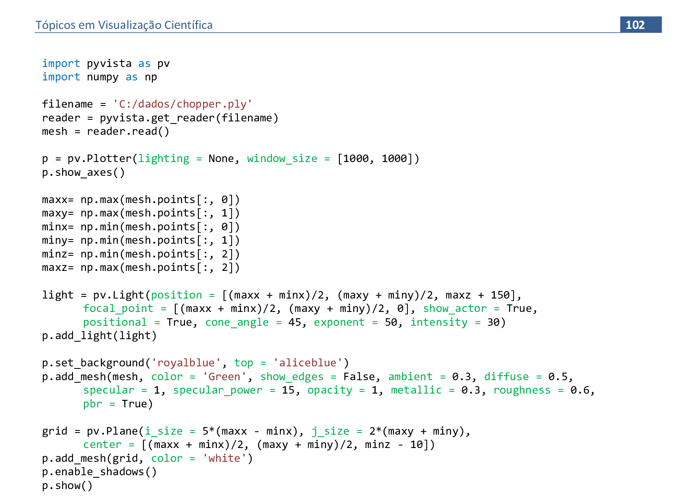
  
<a href="#modulo6" class="topo">voltar ao topo</a>

  
  
<a href="#modulo6" class="topo">voltar ao topo</a>

  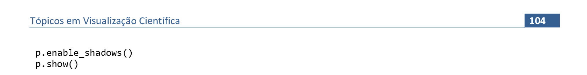
  
<a href="#modulo6" class="topo">voltar ao topo</a>

  
  
<a href="#modulo6" class="topo">voltar ao topo</a>

  
7. Câmera

  
Material da página 105 até a página 114.

  
  
<a href="#modulo7" class="topo">voltar ao topo</a>

  
  
<a href="#modulo7" class="topo">voltar ao topo</a>

  
  
<a href="#modulo7" class="topo">voltar ao topo</a>

  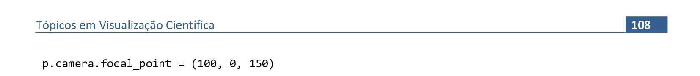
  
<a href="#modulo7" class="topo">voltar ao topo</a>

  
  
<a href="#modulo7" class="topo">voltar ao topo</a>

  
  
<a href="#modulo7" class="topo">voltar ao topo</a>

  
  
<a href="#modulo7" class="topo">voltar ao topo</a>

  
  
<a href="#modulo7" class="topo">voltar ao topo</a>

  
  
<a href="#modulo7" class="topo">voltar ao topo</a>

  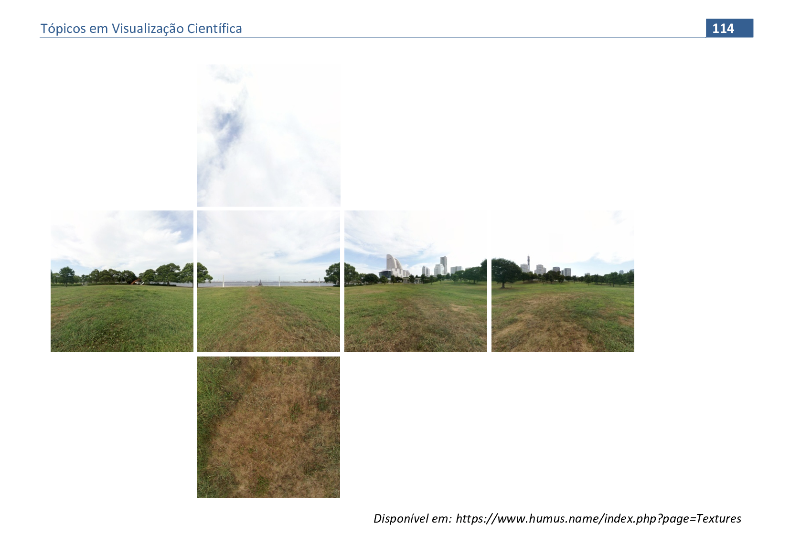
  
<a href="#modulo7" class="topo">voltar ao topo</a>

  
8. Realidade Virtual

  
Material da página 115 até a página 144.

  
  
<a href="#modulo8" class="topo">voltar ao topo</a>

  
  
<a href="#modulo8" class="topo">voltar ao topo</a>

  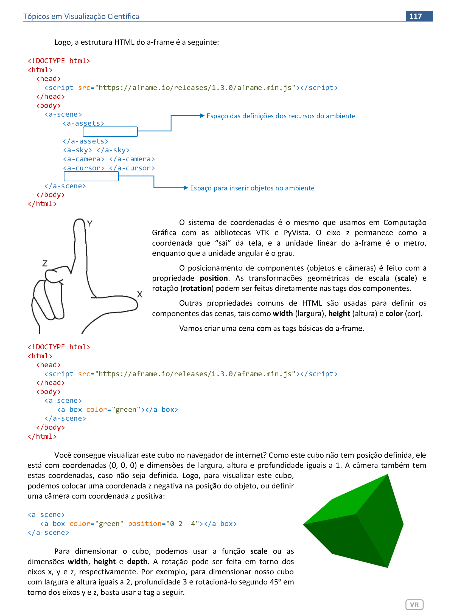
  
<a href="#modulo8" class="topo">voltar ao topo</a>

  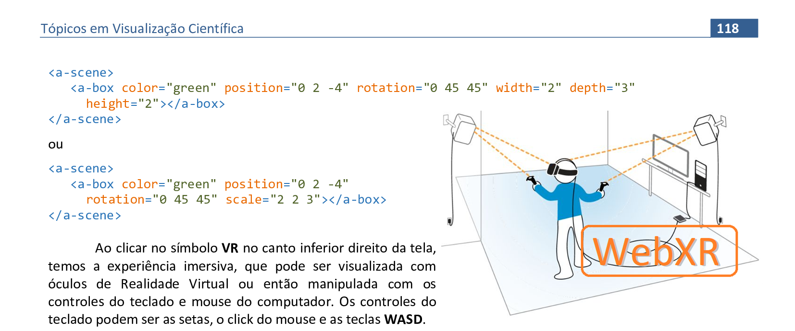
  
<a href="#modulo8" class="topo">voltar ao topo</a>

  
  
<a href="#modulo8" class="topo">voltar ao topo</a>

  
  
<a href="#modulo8" class="topo">voltar ao topo</a>

  
  
<a href="#modulo8" class="topo">voltar ao topo</a>

  
  
<a href="#modulo8" class="topo">voltar ao topo</a>

  
  
<a href="#modulo8" class="topo">voltar ao topo</a>

  
  
<a href="#modulo8" class="topo">voltar ao topo</a>

  
  
<a href="#modulo8" class="topo">voltar ao topo</a>

  
  
<a href="#modulo8" class="topo">voltar ao topo</a>

  
  
<a href="#modulo8" class="topo">voltar ao topo</a>

  
  
<a href="#modulo8" class="topo">voltar ao topo</a>

  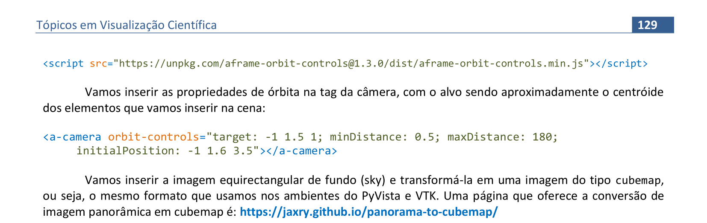
  
<a href="#modulo8" class="topo">voltar ao topo</a>

  
  
<a href="#modulo8" class="topo">voltar ao topo</a>

  
  
<a href="#modulo8" class="topo">voltar ao topo</a>

  
  
<a href="#modulo8" class="topo">voltar ao topo</a>

  
  
<a href="#modulo8" class="topo">voltar ao topo</a>

  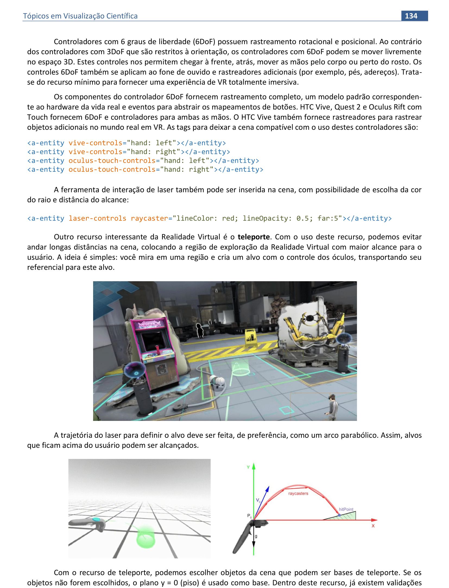
  
<a href="#modulo8" class="topo">voltar ao topo</a>

  
  
<a href="#modulo8" class="topo">voltar ao topo</a>

  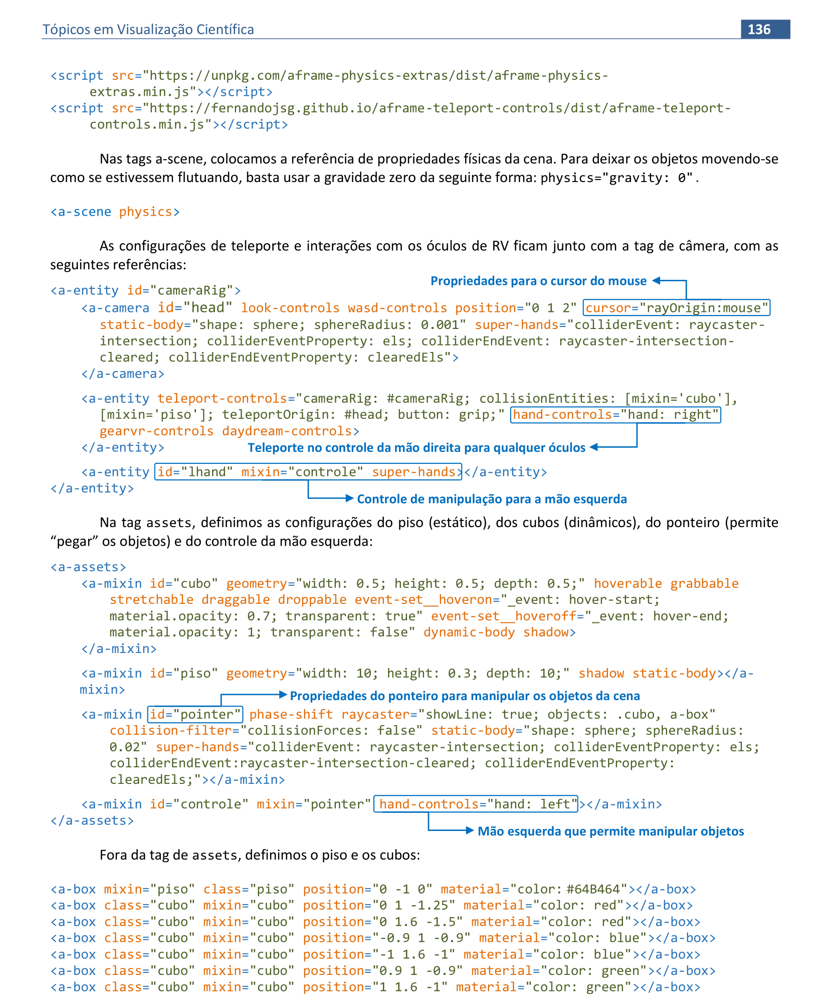
  
<a href="#modulo8" class="topo">voltar ao topo</a>

  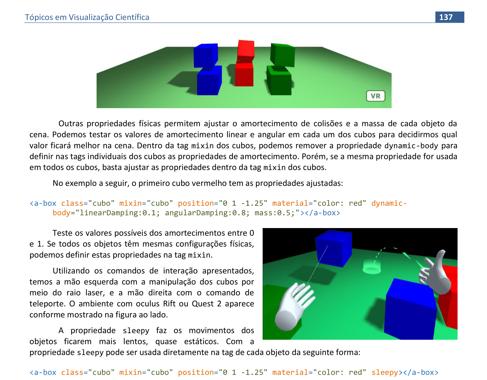
  
<a href="#modulo8" class="topo">voltar ao topo</a>

  
  
<a href="#modulo8" class="topo">voltar ao topo</a>

  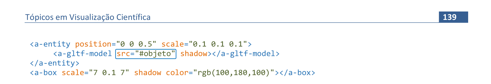
  
<a href="#modulo8" class="topo">voltar ao topo</a>

  
  
<a href="#modulo8" class="topo">voltar ao topo</a>

  
  
<a href="#modulo8" class="topo">voltar ao topo</a>

  
  
<a href="#modulo8" class="topo">voltar ao topo</a>

  
  
<a href="#modulo8" class="topo">voltar ao topo</a>

  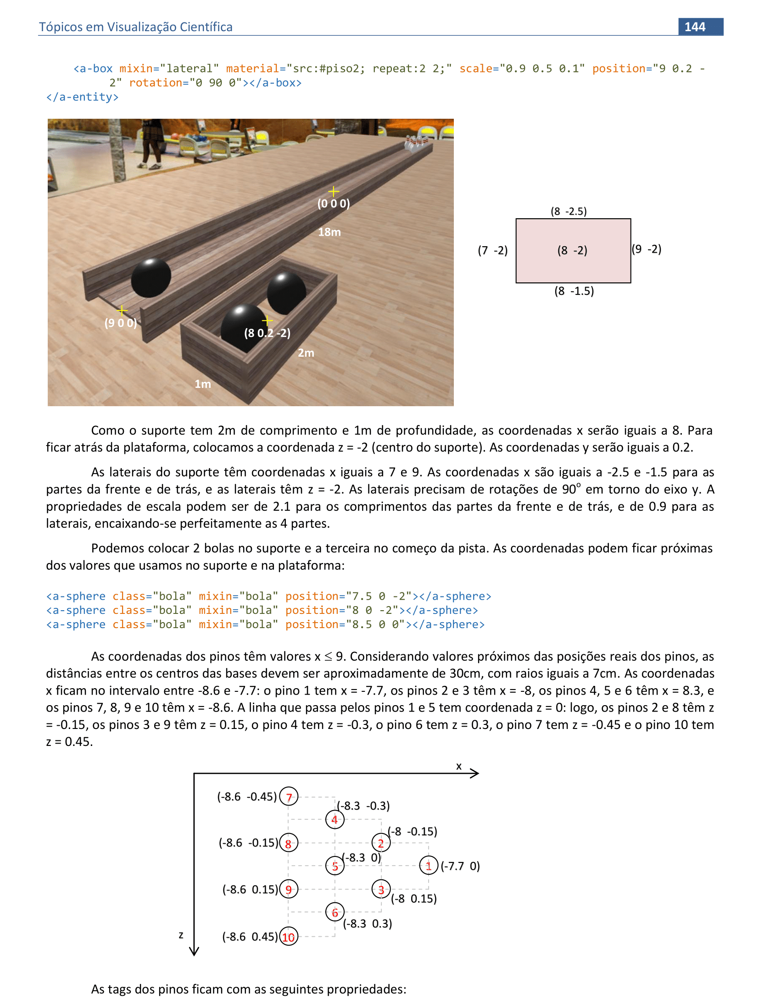
  
<a href="#modulo8" class="topo">voltar ao topo</a>

  
9. Realidade Aumentada

  
Material da página 144 até a página 152.

  
  
<a href="#modulo9" class="topo">voltar ao topo</a>

  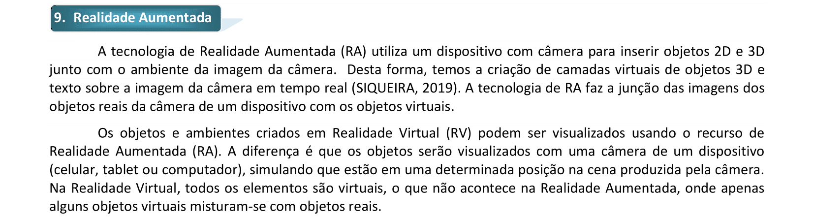
  
<a href="#modulo9" class="topo">voltar ao topo</a>

  
  
<a href="#modulo9" class="topo">voltar ao topo</a>

  
  
<a href="#modulo9" class="topo">voltar ao topo</a>

  
  
<a href="#modulo9" class="topo">voltar ao topo</a>

  
  
<a href="#modulo9" class="topo">voltar ao topo</a>

  
  
<a href="#modulo9" class="topo">voltar ao topo</a>

  
  
<a href="#modulo9" class="topo">voltar ao topo</a>

  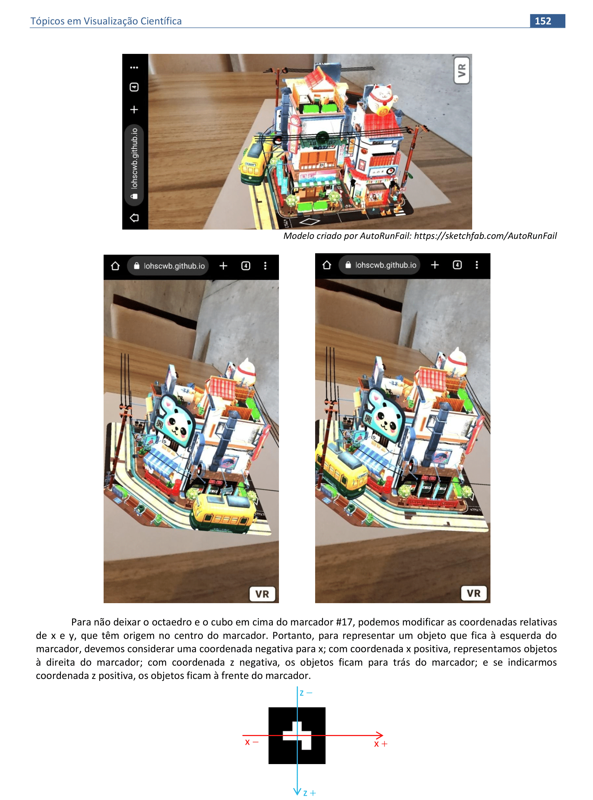
  
<a href="#modulo9" class="topo">voltar ao topo</a>

<h4>página desenvolvida por:</h4> 

Paulo Henrique Siqueira
  

<b>contato:</b> paulohscwb@gmail.com 

<h4>O desenvolvimento deste material faz parte do Grupo de Estudos em Expressão Gráfica (GEEGRAF) da Universidade Federal do Paraná (UFPR)</h4>  

 Visualização Científica de <a xmlns:cc="http://creativecommons.org/ns#" href="https://paulohscwb.github.io/visualizacao-cientifica/" property="cc:attributionName" rel="cc:attributionURL">Paulo Henrique Siqueira</a> está licenciado com uma Licença <a rel="license" href="http://creativecommons.org/licenses/by-nc-nd/4.0/">Creative Commons Atribuição-NãoComercial-SemDerivações 4.0 Internacional</a>.

<h4>Como citar este trabalho:</h4> 

Siqueira, P.H., "Visualização Científica". Disponível em: <https://paulohscwb.github.io/visualizacao-cientifica/>, Agosto de 2022.

<h4>Referências:</h4>
<ol>
	<li>A-frame. A web framework for building 3D/AR/VR experiences. Disponível em: <https://aframe.io/>, 2022.</li>
	<li>Anscombe, F. J. Graphs in Statistical Analysis. American Statistician, vol. 27, n. 1, p. 17–21, 1973.</li>
	<li>Card, S. K., Mackinlay, J. D., Shneiderman, B. Readings in Information Visualization Using Vision to Think. San Francisco: Browse books, 1999.</li>
	<li>Eler, D. M. Visualização de Informação. Disponível em: <https://daniloeler.github.io/teaching/VISUALIZACAO>, 2020.</li>
	<li>Horst, A. M., Hill, A. P., Gorman, K. B. Palmerpenguins: Palmer Archipelago (Antarctica) penguin data. Disponível em: <https://allisonhorst.github.io/palmerpenguins/>. doi: 10.5281/zenodo.3960218, 2020.</li>
	<li>Keim, D. A. Information Visualization and Visual Data Mining. IEEE Transactions on Visualization and Computer Graphics, vol. 8, n. 1, p. 1–8, 2002.</li>
	<li>Keller, P. R, Keller, M. M. Visual Cues: Pratical Data Visualization. Los Alamitos, CA: IEEE Computer Society Press, 1994.</li>
	<li>Moro, C. et al. The effectiveness of virtual and augmented reality in health sciences and medical anatomy. Anatomical sciences education, v. 10, n. 6, p. 549–559, 2017.</li>
	<li>Siqueira, P. H. Desenvolvimento de ambientes web em Realidade Aumentada e Realidade Virtual para estudos de superfícies topográficas. Revista Brasileira de Expressão Gráfica, v. 7, n. 2, p. 21–44, 2019.</li>
	<li>Shneiderman, B. The eyes have it: a task by data type taxonomy for information visualization. In: Proceedings of the 1996, IEEE Symposium on Visual Languages, p. 336–343. Washington, DC: IEEE Computer Society, 1996.</li>
	<li>Telea, A. C. Data visualization: principles and practice. Boca Raton: CRC Press, 2015.</li>
	<li>Ward, M., Grinstein, G.G., Keim, D. Interactive data visualization foundations, techniques, and applications. Massachusetts: A K Peters, 2010.</li>
	<li>Williams, J. G., Sochats, K. M., Morse, E. Visualization. Annual Review of Information Science and Technology (ARIST), v. 30, p. 161–207, 1995.</li>
<ol>
